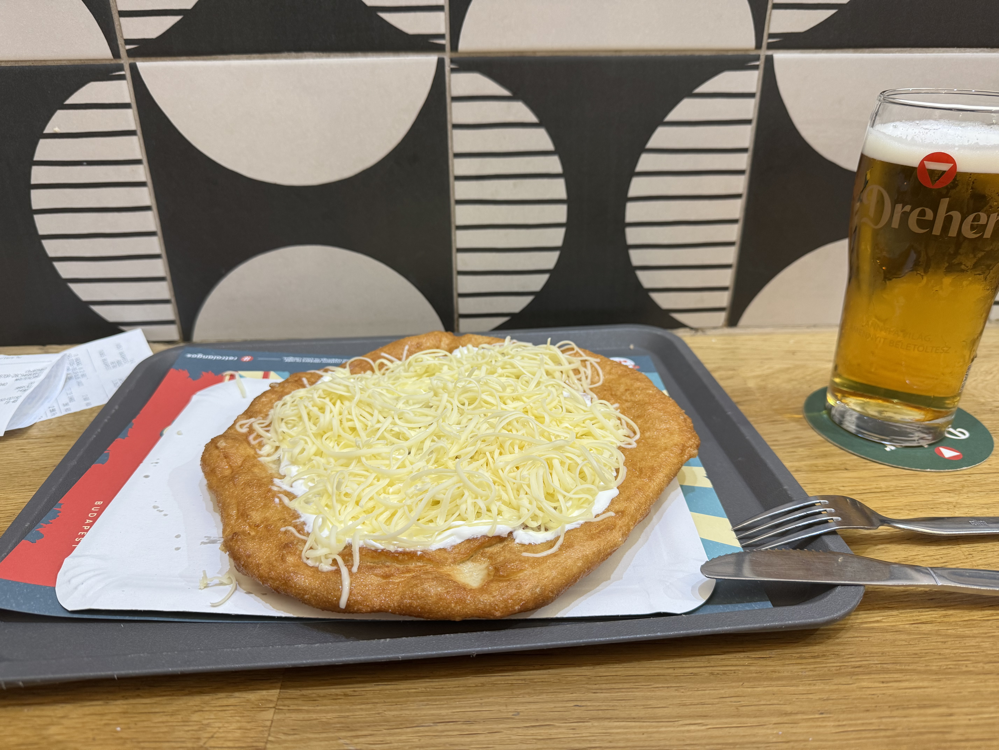

# Kékestető, Ungarn, 1014 moh

_Gjennomført fra 26.09.2025 til 28.09.2025_

Üdvözlöm!

Tiden har kommet for at en ny topp skal bestiges og denne gangen er det Ungarns høyeste topp Kékestető på 1014 moh som skal bestiges. Endelig er man over 1000 meters grensen! Vi finner Ungarn rett øst for Østerrike og toppen Kékestető ligger i Heves fylke, ca 2 timer nord-øst for Ungarns hovedstad Budapest med tog. Og er det en ting jeg kan låve dere i denne episoden av Eltons Europeiske Topper er at dere vil få lengselen etter tog oppfylt!

Vi starter derfor toppturen med å først reise til Budapest via København. Og det viser seg at denne gangen begynner spenningen med en gang det første flyet retter snuten mot København. På vei ut til rullebanen blir en av passasjerene akutt syk, noe som gjør at flyet må tilbake til gaten slik at passasjeren fikk kommet seg av flyet for medisinsk assistanse. Heldigvis ser det ut som alt gikk bra med passasjeren og siden vi ikke var i lufta når det skjedde så rekker jeg flyet videre til Budapest med litt margin i København.

Velkommen til Ungarn og Budapest!

Jeg bruker Budapest som base for toppturen, noe som gir meg masse tid til å utforske byen. Det første som står på menyen er en skikkelig Ungarsk lunsj i en gammel togvogn gjort om til restaurant.

Hvis kule tak er din greie så vil jeg anbefalle å besøke Buda siden av Budapest.

Til og med et tak laget av glass!

Etter en rolig kveld og litt søvn starter turen mot Ungars høyeste topp Kékestető, hvor vi først tar tog til Gyöngyös.

Velkommen til Gyöngyös!

Det går busser hele veien fra Gyöngyös til toppen av Kékestető, men denne gangen ønsker jeg å gå distansen istedenfor. Tur-retur tar det ca. 5-6 timer og viser seg å bli en skikkelig fin tur.

Første etappe er derfor fra Gyöngyös til foten av Kékestető langs hovedveien.

Er tydligvis i Gyöngyös hvor ting skjer, her har man både sirkus og restaurerte toglinjer.

Det ser også ut til å være et problem at veldig mange sykklister kjører av veien her.

Etter ca. 1 time kommer jeg til byen Mátrafüred i foten av Kékestető hvor stien mot toppen begynner.

Veldig fin natur langs stien til toppen.

Stien til toppen er veldig lett å følge siden trærne langs stiden er markert på samme måte som turstier hjemme i Norge.

Litt vanskelig å se det på bilde, men her begynner stigningen å ta seg opp (pun intended). Hittil har stigningen vært relativ flat.

Ikke langt igjen til toppen nå!

Og med det er Ungarns høyeste topp Kékestető på 1014 meter over havet besteget!

Det som er så rart som Nordmann å besøke høy steder sør i Europa er alle trærne så høyt i fjellene. I Norge så finnes det jo neste ikke et tre på 1000 meters høyde, selv på østlandet. Alle trærne på toppen gjør det derfor også vanskelig å få tatt noen skikkelige bilder av utsikten på toppen.

Obligatorisk.

Etter å nytet en Nederlandsk øl i de Ungarske høydene begynner jeg turen ned igjen fra Kékestető.

Tilbake i Mátrafüred får jeg øye på togstasjonen til det samme toget som møtte meg på vei oppover, hvor det heldigvis går et tog ned igjen til Gyöngyös om ikke så alt for lenge.

Og for et tog! Her fikk man sitte i fri luft og nyte sola mens toget suste nedover langs åsen.

<video controls>
  <source src="/35_ungarn/IMG_2124.MOV" type="video/mp4">
</video>

Choooo Chooooo!

<video controls>
  <source src="/35_ungarn/IMG_2125.MOV" type="video/mp4">
</video>

Etter det skikkelig kule toget er det litt kjedelig å så skulle tilbake til et helt vanlig rutetog tilbake til Budapest. Men et tog er bedre en ingen tog!

Tilbake i Budapest og enda en togstasjon som får meg til å tenke på hvor kjedelige de moderne togstasjonene er.

Med en ny topp under beltet feirer jeg med en ny Ungarsk rett, nemlig Langos. Et stykke frytert brød ofte spist med ost og en hvit saus som jeg tror var surkrem. Overraskende godt.

Men med det nyter jeg siste rest av Budapest før det er på tide å reise hjem igjen til Norge.

[Találkozunk Írországban!](/topper/34_irland)

