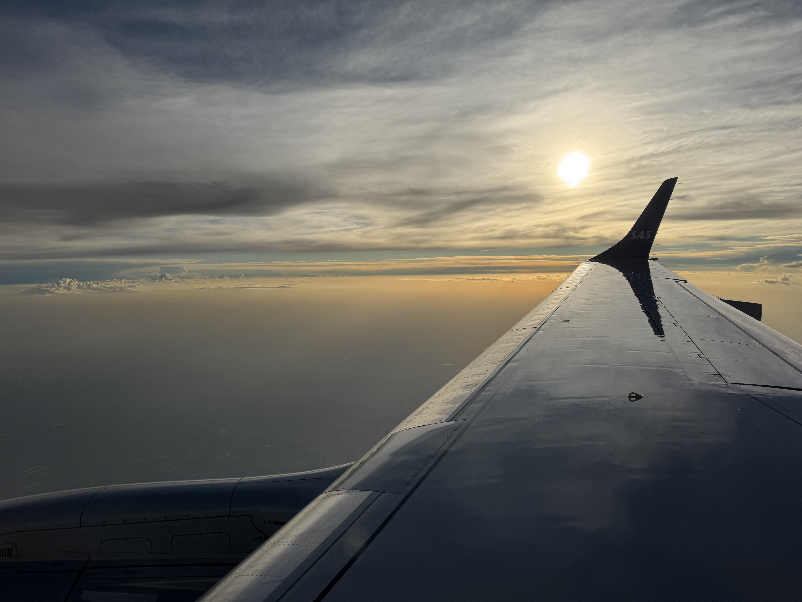
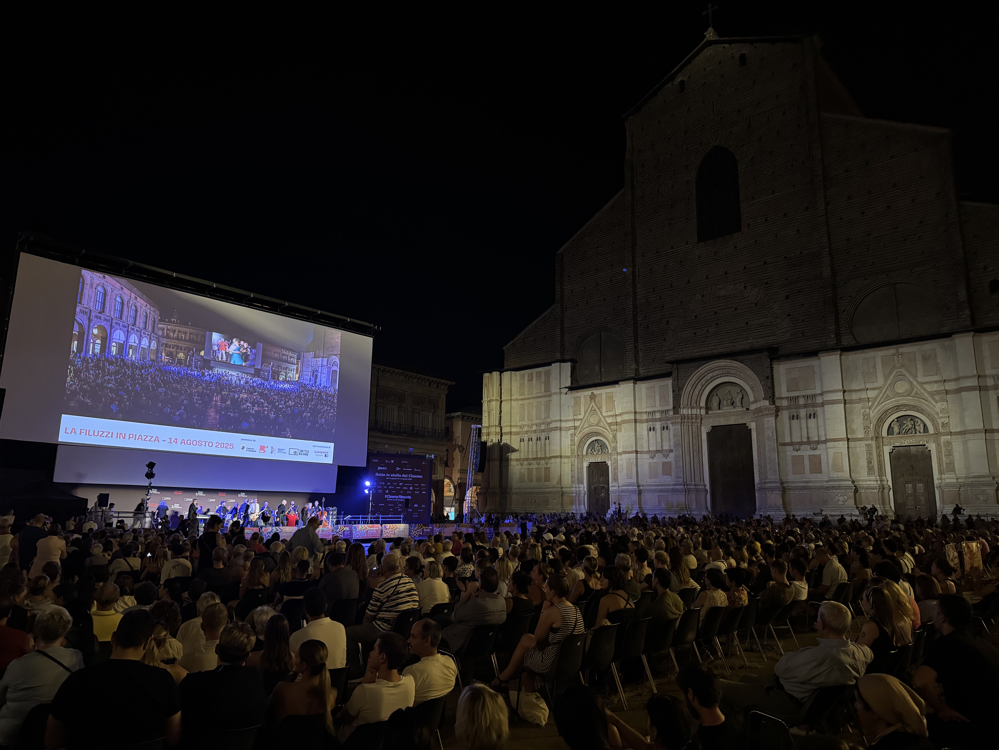
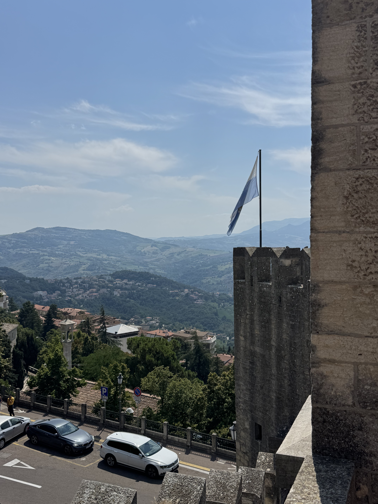
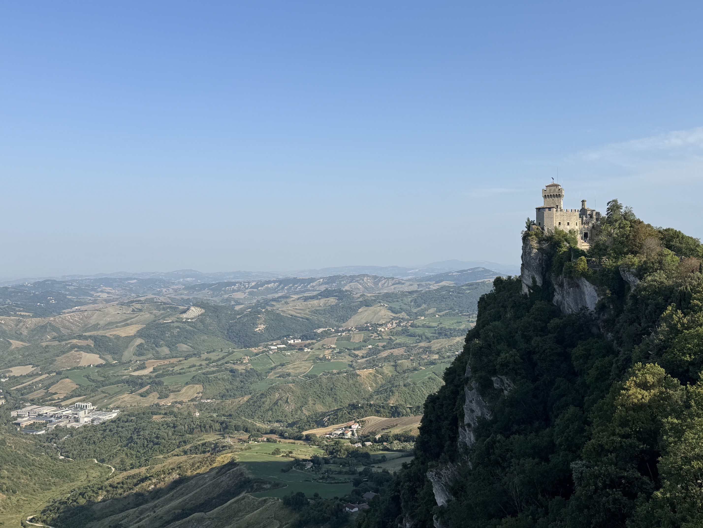
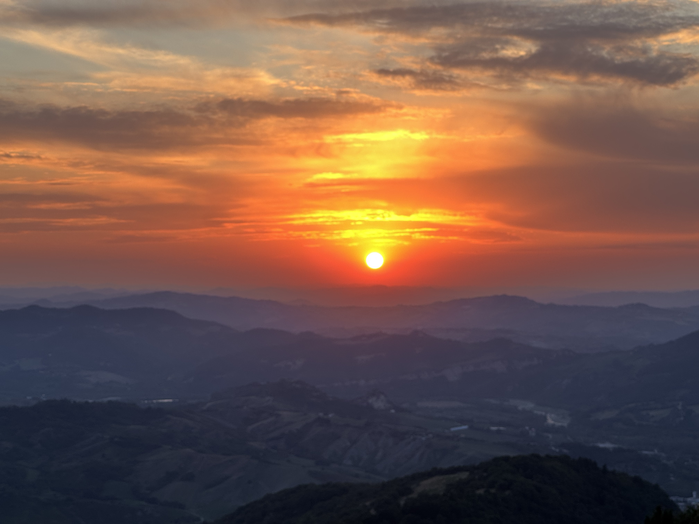
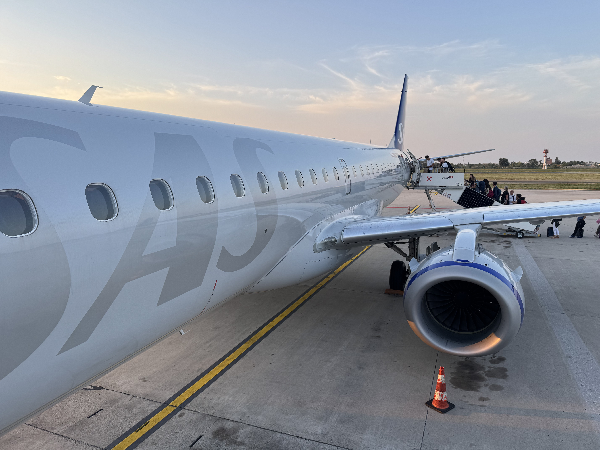
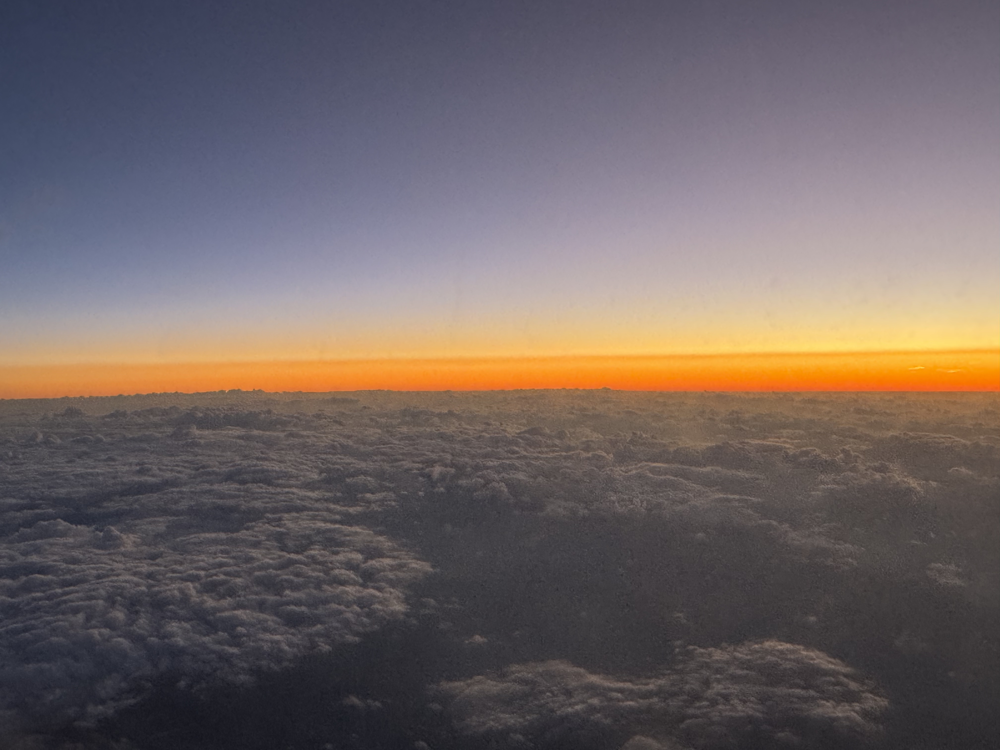

# Monte Titano, San Marino, 749 moh

_Gjennomført fra 14.08.2025 til 17.08.2025_

Ciao!

Tiden har kommet for en ny topp, hvor det denne gangen skal bestiges toppen til en av Europa's mikrostater. Nemlig San Marino og toppen Monte Titano på 749 moh! San Marino er et knøttlite land på 61 kvadratkilometer (femte minste i verden) som befinner seg midt i Italia, sør-øst for Bologna nær kysten til Adriaterhavet.

Det er derfor lettest å først reise til Bologna også reise videre derifra, så la oss gjøre det!

Og for en velkomst jeg får i Bologna! Første som møter meg midt i historiske sentrum er live orkester med gammel Italiensk musikk. Mer Italiensk stemning får man ikke.

Jeg lurte litt på hvorfor gatene i Bologna var så tomme fredag morgen, men viser seg at det var en helligdag den dagen. Hver 15. august feires Jomfru Marias opptagelse i himmelen (Assunzione), som da betyr at alle Italienere har langheld denne helgen. Litt kult å få med seg, men litt slitsomt skal det også skal bli senere i turen.

Samme morgen begynner jeg reisen fra Bologna til San Marino, hvor jeg først må ta toget til kystbyen Rimini på Adriaterhavet.

Etter ca 1 time og 30 min ankommer jeg Rimini, hvor denne folkemengden sier litt om hvor mange som reiser på denne dagen. Toget var smekkfult hele veien fra Bologna og det å få sitteplass var nesten bare å glemme. Heldigvis får jeg plass ved siden av en snorkende Italiener. Litt får jeg tåle når andre må stå. 

Fra Rimini går det så med buss til San Marino. Heldigvis skulle de fleste ikke videre til San Marino så på bussen er det god plass.

Langs veien får vi et lite glimt at San Marinos høyeste punkt, Monte Titano.

Etter ca. 50 minutter ankommer vi San Marino!

San Marino regnes som den eldste republikken i verden og har mange av byggene er relativt inntakt. Det er derfor en veldig kul by å utforske, selv om 33 plussgrader gjør det litt mer slitsomt.

Utsikten mot resten av San Marino, Italia og Adriaterhavet er ikke så gærnt det heller.

Denne gangen har jeg tenkt til å bruke to forskjellige veier til å komme meg til toppen. Den lette turistifiserte veien, samt den mer eventyrlystige veien.

La oss starte med den lette turistifiserte veien som starter i sentrum av San Marino By.

Skjønner egentlig hvorfor alle liker å gå den lette veien, er ganske flott her.

Måtte dobbeltsjekke litt på kartet, men det her er altså toppen!

Og med det er Monte Titano på 749 meter over havet besteget! Endelig begynner det å bli skikkelig utsikt fra disse toppene!

Før jeg tar fatt i den mer eventyrlystige veien nyter jeg solnedganger og får meg litt søvn.

Selv om jeg ikke fikk noe bilder av det, så er det verdt å si litt om stedet jeg boddet under oppholdet i San Marino. Under reserveringen leste jeg bare at det var billig, sentralt lokalisert og hadde gode anmeldelser. Viste seg at "hotellet" var i samme bygg som en resturant, hvor både vi gjestene og de ansatte på resturanten delte gang. Var noen ganger hvor jeg fikk øyekontakt med kokken inn til køkkenet på vei opp til rommet. Var heller ikke spesielt deilig å prøve å sove til lyden av oppvask kl. 23:30 på kvelden.

Heldigvis får jeg i meg nok søvn og er klar for dagens topp økt. Denne gangen starter vi med å gå nedover fra gamlebyen mot den nyere biten av San Marino, hvor vi så skal følge klippene langs San Marino.

Merker allerede at jeg synes denne veien er mye kulere enn den turistifiserte veien.

Vet ikke helt hvor trygg jeg føler meg ved å gå på _innsiden_ av skredsikringen, får håpe det ikke går noen skred!

Rundt om i San Marino er det veldig mange andre fine turer som man kan gå hvor "Cammino del Titano" er en sammling av de beste turene.

Og der var toppen erobret en gang til!

Etter turen langs klippen ved San Marino by så har jeg enda litt tid til å utforske San Marino...

... men noen ganger lurer jeg på hva pokkern nysgjerrigheten min får meg til å gjøre. Denne gangen klarer jeg å få den gode ideen at en operativ jernbanetunnell skal jeg inn å utforske. Heldigvis gikk det ingen tog denne dagen.

Var ganske kult å gå på stiene langs klippen på kveldstid også.

Dagen etter går turen hjemover sammen med resten av Italia, noe som skal vise seg å være et skikkelig helvete til tider. For å komme meg tilbake til Bologna er det samme overfylte tog, bare denne gangen så får jeg ikke sete og må stå i 1 time og 30 min. 

Senere på vei mot flyet så tenker jeg å sette av god tid på flyplassen, men det jeg ikke vet er at det vanskelige blir å komme seg til selve flyplassen. Det var bokstavelig talt kø for å komme seg til stasjonen for banen som tar deg videre til flyplassen, så her måtte man vente i kø for hver avgang. Finner fort ut at jeg kommer til å miste flyet hvis jeg fortsetter å stå i den køen, så begynner arbeidet med å heller finne en taxi. Heldigvis klarer jeg å finne en taxi, men er selvfølgelig kø på motorveien til flyplassen. Alt i alt så planla jeg 3 timer på flyplassen, men endte opp med å være der 10 min før boarding. Alt dette skjedde mens det var 37 stekende grader i Bologna.

[Ci vediamo in Ungheria!](/topper/35_ungarn)

