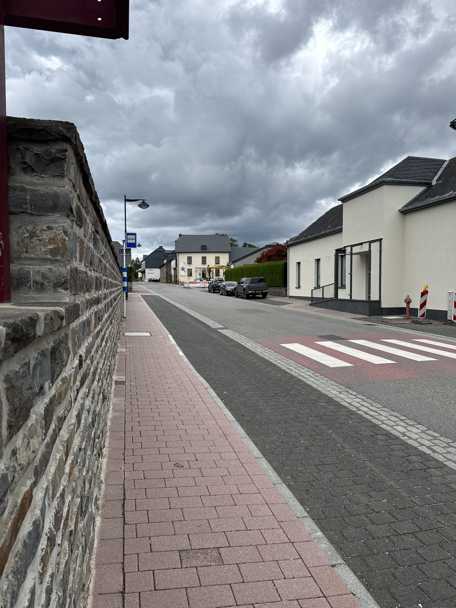
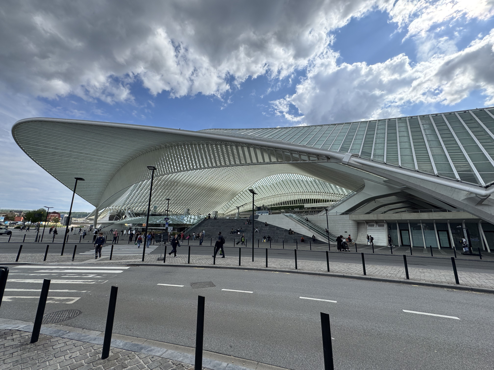
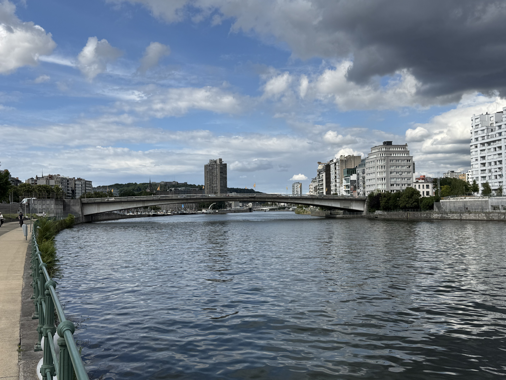
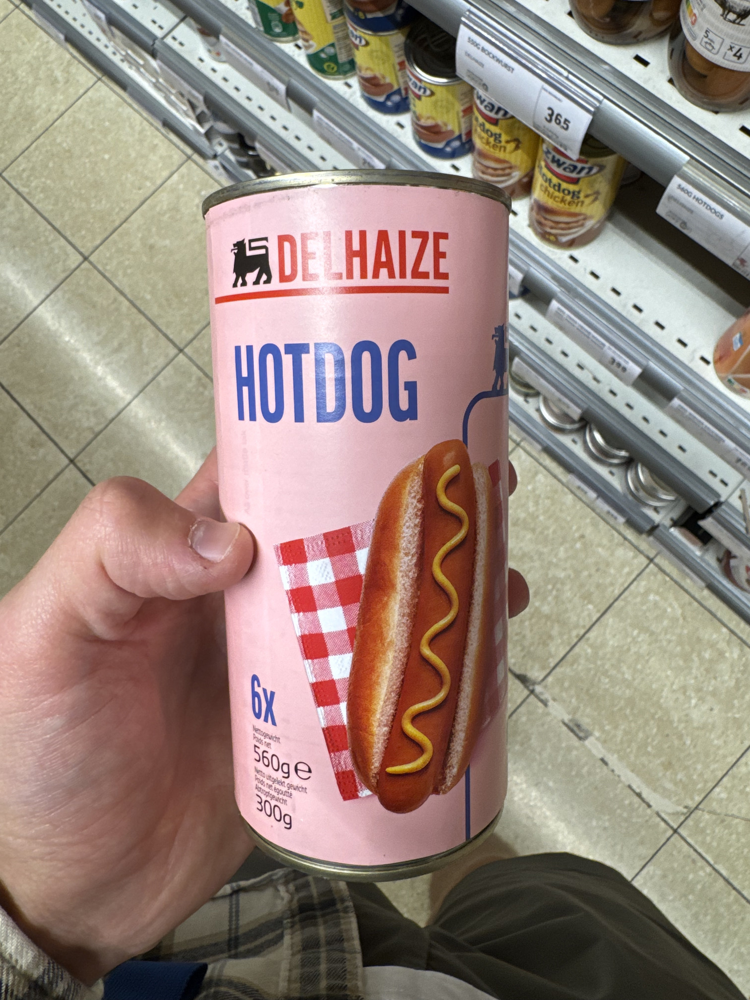
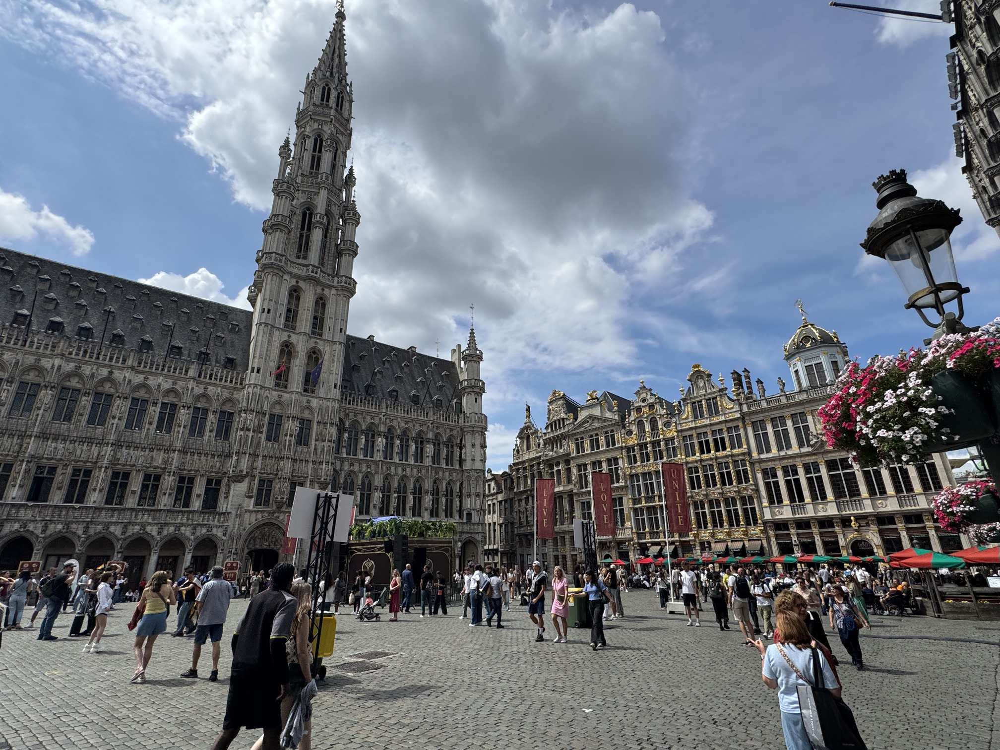
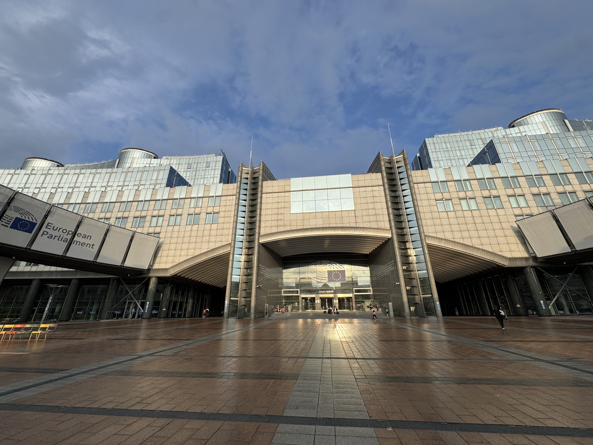
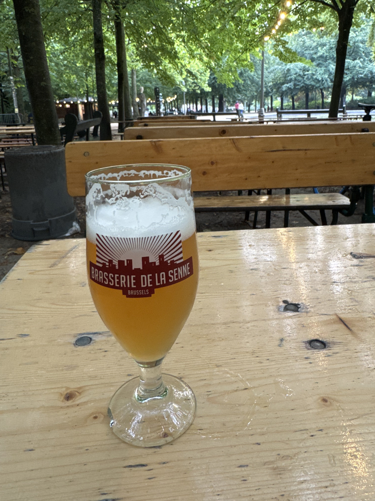
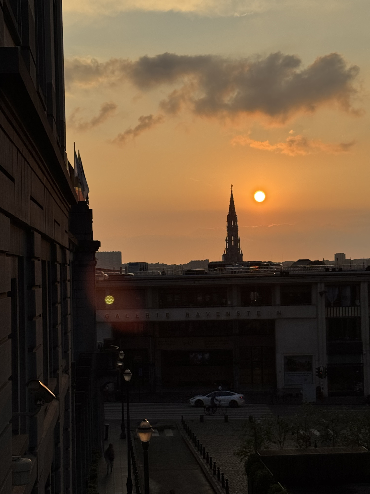
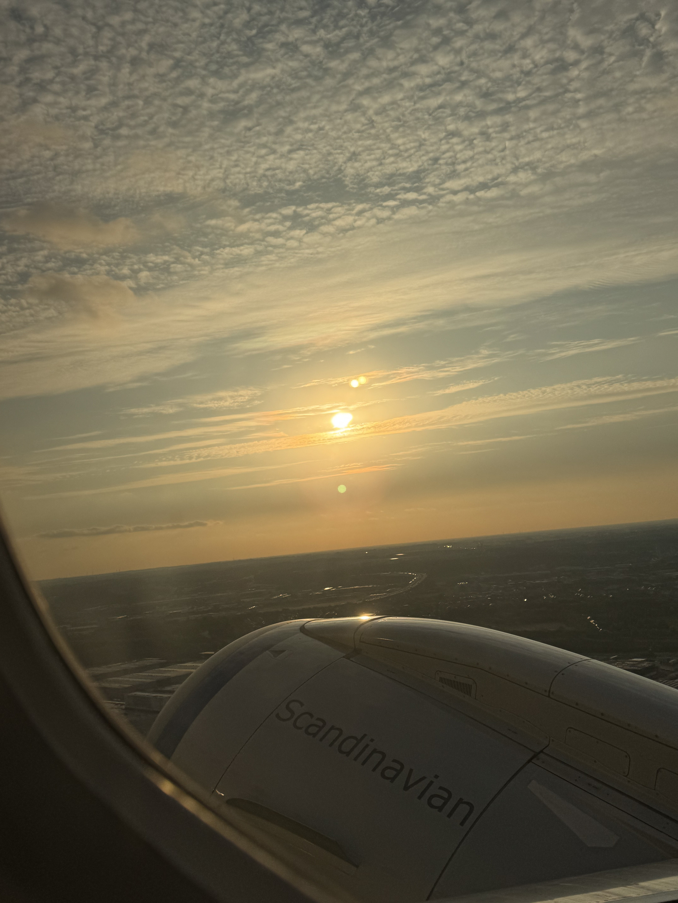

# Signal de Botrange, Belgia, 694 moh

_Gjennomført fra 20.07.2025 til 25.07.2025_

Dette er andre av to episoder hvor jeg besøker Luxembourg og Beliga sine høyeste topper i samme tur. Dette fordi toppene ligger ganske nærme hverandre ved grensa mellom Luxembourg og Belgia.

[Her finner du episode en: Kneiff, Luxembourg, 560 moh](/topper/38_luxembourg)

---

Bonjour!

Velkommen tilbake! Etter et kort opphold i de Luxembourgiske høydene er det på tide på bestige Belgias høyeste topp, Signal de Botrange på 694 moh. Beliga ligger mellom Frankrike og Nederland, hvor vi finner Signal de Botrange i Hautes Fagnes området øst i Belgia.

Vi starter dagens tur i den lille landsbyen Wilwerdange i Luxembourg, hvor jeg venter på lokalbussen til Troisvierges og tog videre til Liege i Øst-Belgia.

Jeg må si jeg blir litt missunelig på noen av togstasjonene i Europa. Liege-Guiellemins er sentralstasjonen for en by med 200 000 innbygger, også er den så kul.

Siden jeg har vært på konstant reise i noen dager så tar jeg en rolig dag i Liege før det går videre mot Signal de Botrange.

For å komme seg til Signal til Botrange må man først ta tog til Eupen, øst for Liege. På stasjonen ser jeg at toget mitt er markert med "(Formel 1)" og jeg lurer på hvorfor det er så mange med Red Bull caps på toget. Viser seg at jeg helt tilfelldig har dratt til et område av Belgia hvor det holdes Formel 1 løp den helgen. Desverre har jeg planlagt hjemreise til Norge dagen før løpet og billetter begynner på 4000 kroner.

I Eupen har jeg litt tid på å utforske Eupen's delikatesser... før det så går med lokalbuss opp til Signal de Botrange.

Sjåføren av lokalbussen var en av de mest service instillte bussjåførene jeg har møtt noensinne. Så dum som jeg er så hadde jeg ikke tatt ut cash for bussturen og dermed kunne ikke betale, derfor går jeg bare på bussen og håper på at alt går bra. Bussfjøren tar så ruta si før han stopper hele bussen uten for ett kontantuttak hvor han holder igjen bussen til jeg får løpt og tatt ut penger for bussturen. En ekte legende Belga.

Med en liten busstur er vi på Belgias høyeste punkt, Signal de Botrange på 694 meter over havet! Naturen minner meg egentlig litt om den Norske fjellheimen.

Etter å ha vært på Beliga høyeste punkt går turen videre med tog fra Eupen til Brussel, Belgias hovedstad.

I Brussel har jeg 1 natt før det er på tide å reise hjem igjen til Norge

Det som er farlig med Belgia er at ølet dems er som en tikkende bombe. Det som ser ut som en helt vanlig pilsner inneholder 10% alkohol og når du reiser deg blir du rimelig svimmel.

[Rendez-vous à Saint-Marin!](/topper/36_san_marino)

