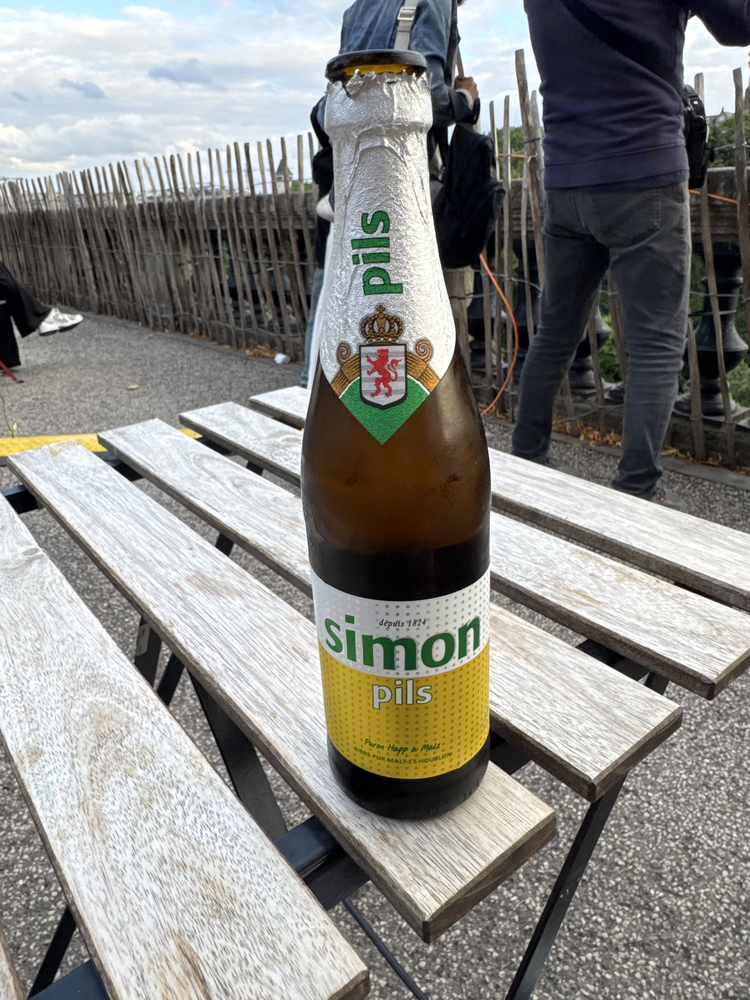

# Kneiff, Luxembourg, 560 moh

_Gjennomført fra 20.07.2025 til 25.07.2025_

Dette er første av to episoder hvor jeg besøker Luxembourg og Beliga sine høyeste topper i samme tur. Dette fordi toppene ligger ganske nærme hverandre ved grensa mellom Luxembourg og Belgia.

[Her finner du episode to: Signal de Botrange, Belgia, 694 moh](/topper/37_belgia)

---

Hallo!

Velkommen tilbake til ett nytt program i topp-jagingen, hvor det denne gangen er Luxembourg og toppen Kneiff på 560 moh som skal bestiges. Landet Luxembourg ligger skvist mellom Frankrike, Belgia og Tyskland. Toppen Kneiff ligger nord i Luxembourg i Troisvierges kommune, rett inntil grensa til Belgia i Ardennene.

Turen til Luxembourg er en av den litt mer inderekte arten, for denne gangen skal jeg gjøre noe som jeg har hatt lyst til lenge! Nemlig å ta toget fra Oslo hele veien til Tyskland, for å så reise videre til Luxembourg med fly. 

Vi starter derfor turen på Oslo S, hvor vi denne gangen ikke skal til Oslo lufthavn, men sørover med toget til Malmø.

Etter ca. 3 timer ankommer vi Gøteborg Central hvor det så er nye 3 timer og 30 min videre til Malmø langs kysten av Sverige.

Velkommen til Malmø!

Jeg hadde først planlagt overnatting i Købenahvn, men den danske kronekursen gjorde det for dyrt. Istedenfor har jeg en natt Malmø og bruker resten av dagen til å utforske byen.

Malmø er en fin by, men jeg merker å utforske byen i 32 varmegrader er i overkant slitsomt. Det blir derfor en tidlig kveld før turen videre mot Hamburg. For å komme til Hamburg må man først med tog over Øresund.

<video controls>
  <source src="/38_luxembourg/tog_over_øresund_720p.mov" type="video/mp4">
</video>

Velkommen til Danmark og København!

Etter en liten stopp i København går det videre med tog til Hamburg. Er litt morsomt hvordan man er så langt øst i Danmark som mulig, men så klarer Deutche bahn fortsatt å skape trøbbel. På toget til Hamburg var det tilsynelatende uten grunn 2 vogner som var stengt, dermed ble det rimelig trangt i resten av toget. Heldigvis klarer jeg å kapre et vindusete.

<video controls>
  <source src="/38_luxembourg/IMG_1460_720p.mov" type="video/mp4">
</video>

Over sjøen til Fyn og Odense.

<video controls>
  <source src="/38_luxembourg/IMG_1462_720p.mov" type="video/mp4">
</video>

Det er en grunn til at Danmark sin topp høyeste topp er relativt lav, for det er rimelig paddeflatt gjennom hele Danmark og sørover mot Hamburg.

Etter ca. 4 timer når vi Rendsburger Hochbrücke som er jernbanebruen over Kielkanalen, som betyr at vi ikke er alt for langt unna Hamburg.

Velkommen til Tyskland og Hamburg!

I Hamburg har jeg en natt til å utforske byen før jeg reiser videre mot Luxembourg.

Ankret opp i Hamburg finner vi skipet "Great Benin", et av skipene som fylles opp med Europeisk søppel som sendes til Afrika.

Med en natt bak meg i Hamburg er det enedlig på tide å komme seg til Luxembourg. Å ta tog fra Hamburg til Luxembourg ville tatt ca. 10 timer. På grunn av det og siden jeg allerede har tatt tog gjennom deler av Tyskland så velger jeg å fly til Luxembourg via Frankfurt.

Velkommen til majestetiske Luxembourg og Luxembourg by! Et av de kuleste stedene i Europa!

Jeg har allerede besøkt Luxembourg by en gang før. Men det er umulig å ikke besøke byen uten å begå seg ut på en skikkelig byvandring.

Trappetreningen på jobb kommer godt med i Luxembourg.

Han Simon er en populær kar i Luxembourg.

Dagen etter er det på tide å bestige Luxembourgs høyeste topp. Turen går derfor videre med buss og tog til byen Troisvierges nord i Luxembourg.

Fra Troisvierges er det så lokalbuss videre mot grensen til Belgia og litt trasking langs veien mot toppen.

Endelig er toppen i sikte!

Luxembourgs høyeste punkt, Kneiff på hele 560 meter over havet.

Selv om jeg endelig begynner å kommet til noen av de litt "høyere" toppene virker det ikke spesielt høyt.

Etter å ha spist lunsj på toppen går turen tilbake mot Troisvierges og Belgias høyeste topp.

[En retrouvailles en Belgique!](/topper/37_belgia)

