# Dealul Bălănești, Moldova, 430 moh

_Gjennomført fra 18.06.2025 til 22.06.2025_

Buna ziua!

Nå skal det bestiges en ny topp i et ganske spesielt land, nemlig Moldova og toppen Dealul Bălănești på 430 moh! Hvis du har fasinasjon for gamle Sovjetunionen og mindre besøkte land i Europa så tror jeg du vil like denne episoden av Eltons Europeiske Topper. Moldova finner vi mot Sortehavet mellom Ukraina, Romania og Tyrkia, mens Dealul Bălănești ligger vest i landet.

Moldova er et land som er ganske billig å oppholde seg til, men som koster en god del å fly til. For å holde lommeboka relativt i kontrol må jeg derfor først fly øst til Riga, sør-vest rundt Ukraina, også øst igjen til hovedstaden Chisinau.

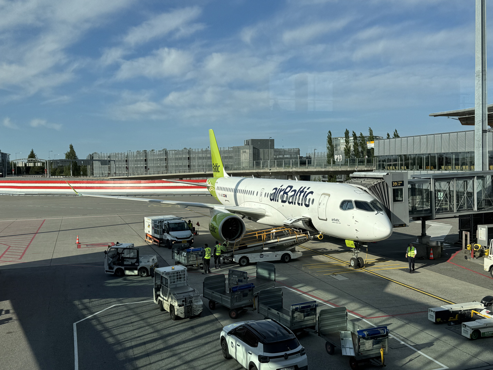

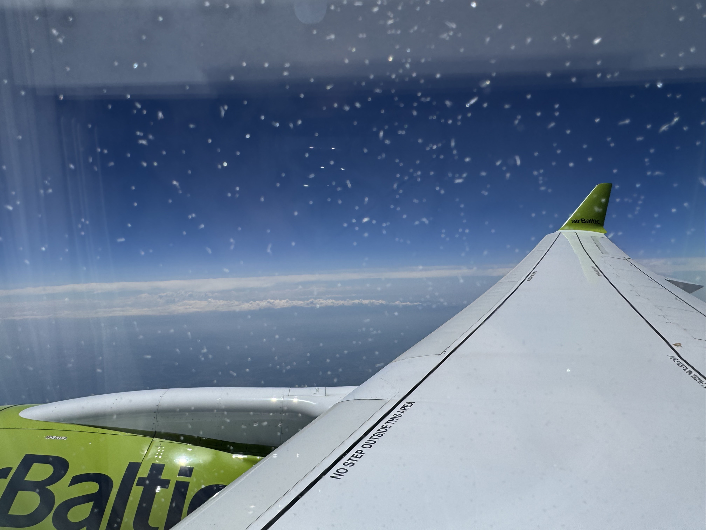

Velkommen til Moldovas hovedstad, Chisinau!

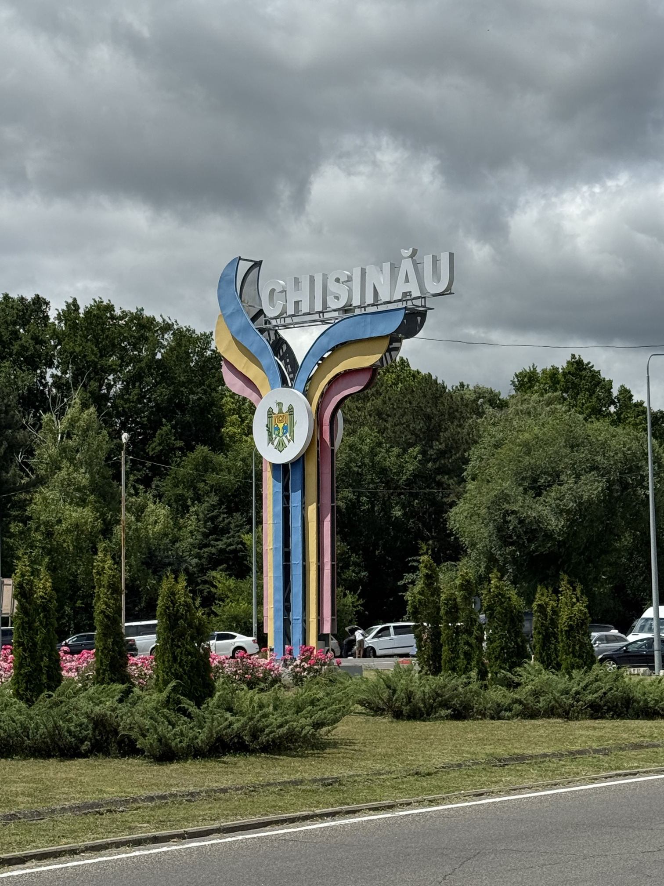

Det tar ikke lang tid fra jeg setter meg i taxien fra flyplassen til sentrum før jeg får smake på hvordan det var i Moldova under Sovjetunionen, det her er fra hovedgaten gjennom sentrum av Chisinau.

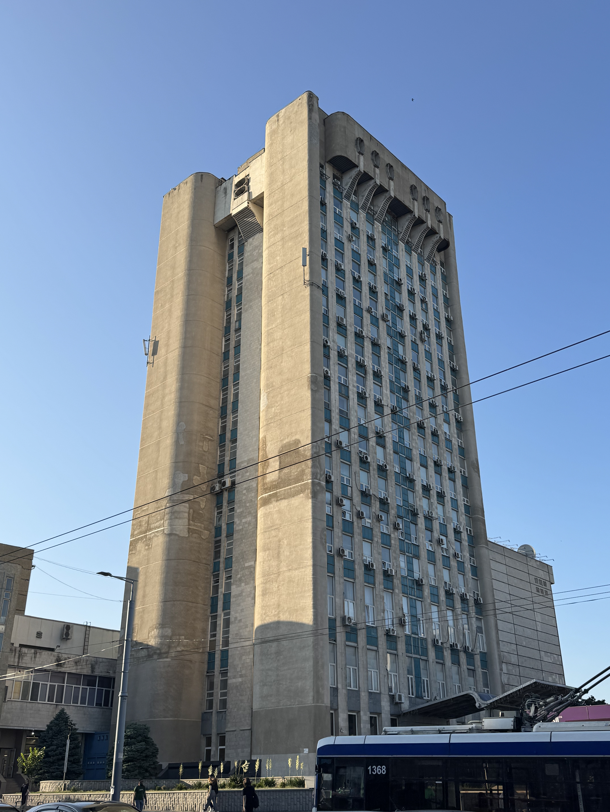

Men selv om det kanskje virker som Chisinau har stått stille i 40 år, så er byen overraskende fin! Jeg var den eneste turisten og byen har mange områder som er godt vedlikeholdt.

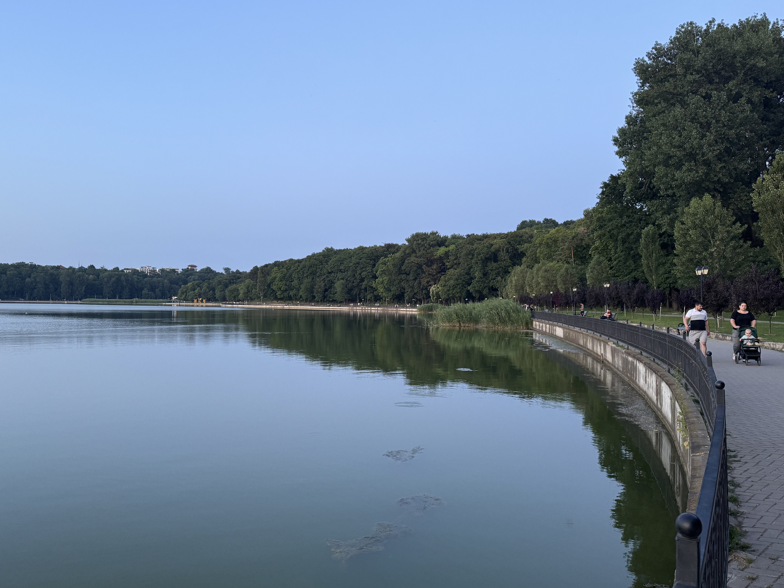

Den største parken i Chisinau har til og med sin egen strandlinje, så ingen grunn å reise til Granca.

Men ved litt loffing rundt i 30 varmegrader på asfalt så lengter man fort etter de kalde høydedragene. Turen går derfor mot Moldovas høyeste topp dagen etter. 

Som i mange andre land er det vanskelig å bevege seg rundt med offentlig transport. Det samme gjelder for Moldova, hvor offentlig transport er så og si ikke eksisterende utenfor Chisinau. Derfor må man ty til leiebil denne gangen også. 

Litt morsomt at når man spør mannen i leiebil-skranken hva fartsgrensen i landet er, så blir man forklart hvordan man kan best holde seg innenfor loven ved å kjøre 9 km/t over fartsgrensen. Det gir gode tegn for hva slags type kjøring man kan forvente...

... og det å kjøre i Chisinau er mildt sagt stressende, man må passe en hel del lovløs kjøring og hull i veibanen som ikke har blitt fikset siden Gorbachev sin tid. Heldigvis er veiene utenfor Chisinau mot Balanesti fine.

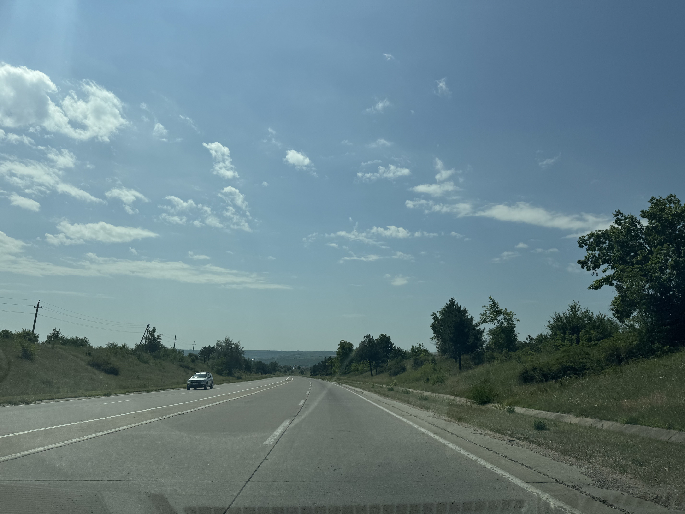

Balanesti ligger ca. 1 time og 30 minutter kjøring vest for Chisinau.

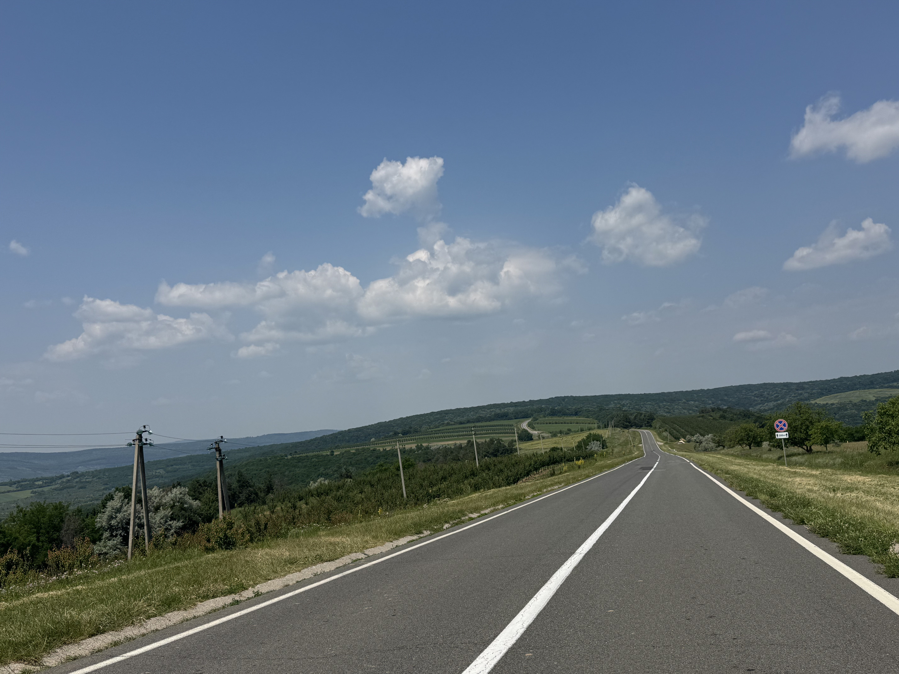

Velkommen til Balanesti!

I Balanesti setter jeg fra meg bilen og begynner den ca. 30 minutter lange turen mot Moldovas høyeste punkt Dealul Bălănești.

Kanskje jeg kan få skyss til toppen av Igor.

Dealul Bălănești i det fjerne.

Toppen i sikte!

Og med det er Moldovas høyeste punkt Dealul Bălănești på 430 meter over havet besteget!

Selv om man skulle tro at det var litt kaldere i høyden, så er det 33 grader og stekende sol på toppen. Det går derfor fort ned igjen til klimaanlegget i leiebilen.

Når man først har satt av tid og penger til å reise hele veien til Moldova så må man bruke muligheten til å se litt av landet. Turen går derfor videre til Orhei fylke, et område av Moldova som skal ha vakker natur. Orhei fylke ligger ca. 1 time nord for Chisinau og tar ca. 2 timer å kjøre fra Balanesti.

I Orhei fylke velger jeg å bo i landsbyen Trebujeni som har god tilgjengelighet til naturen i Orhei. Det er ikke spesielt mye å velge mellom av overnatting, men utrolig nok så kan man leie en nyrenovert cargo container som feriehus.

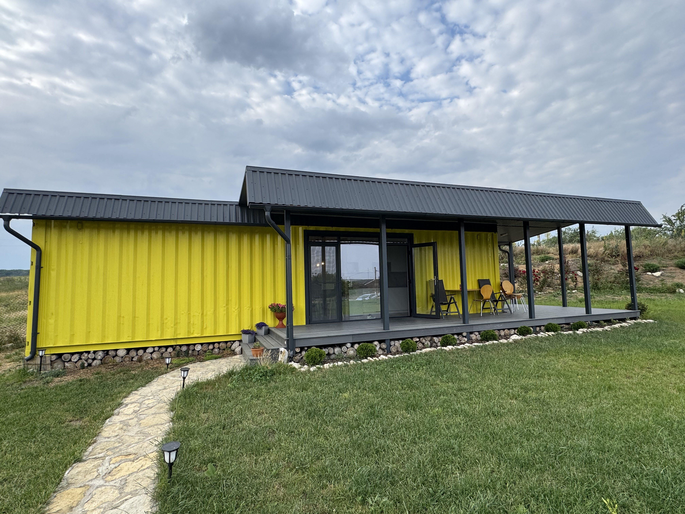

Ender faktisk opp med å sitte å prate med vertene av ferie-containeren den ene kvelden. For å ungå støyen i Chisinau kjøpte de tomta for å bygge B&B i landsbygda og det samme året som jeg besøkte var året de begynte å ta imot gjester. Jeg var faktisk den første utenlandske gjesten de tok i mot.

Vi prater om hvordan livet er i Moldova og Norge, hvor vi kommer frem til at livene våres egentlig ikke er så forskjellige. Som oss i Norge har de unger å passe på, svigermor maser som vanlig og alt for mye penger som går til regninger. Den største forskjellen er at Moldovere elsker store familiefester, men av en litt deprimerende grunn. Mange familier forventer store bryllupsfester med live-band og svære måltider. Mest fordi mange har besteforeldre som ble sendt til Gulager eller rett og slett levde med for lite mat under sovjetunionen. Derfor blir det sett som en stor seier å endelig kunne spandere på en skikkelig overdådig fest, selv om det kan koste opp mot 50 000 euro og en gjennomsnittlig Moldover tjener 9000 euro i året.

Utover å være hyggelige å prate med så ble jeg servert te med urter fra hagen til vertene og frokost blir levert på døra hver dag. 

Neste dagen begynner utforskingen av Orhei fylke og jeg skjønner hvorfor de synes området er vakkert. Rett fra Tribujeni er det masse fine turstier å velge mellom.

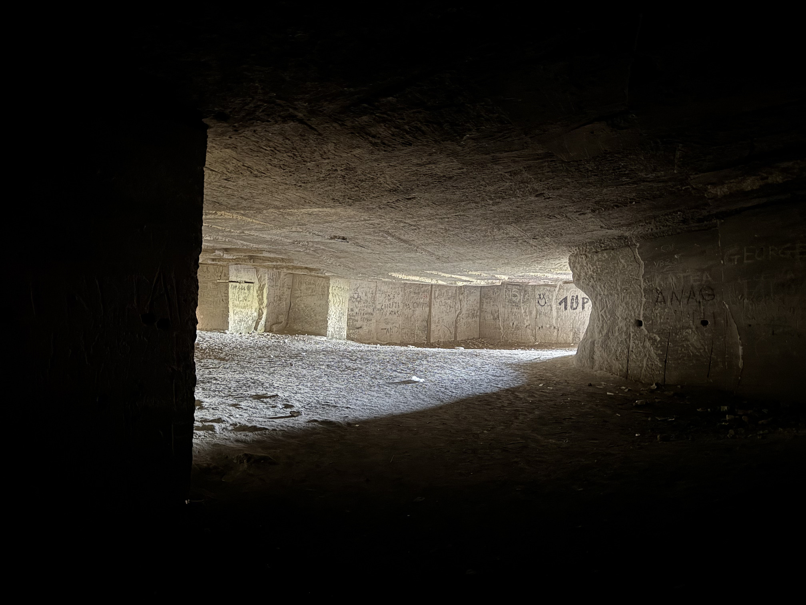

Videre langs dalen over elven Raut går jeg gjennom vin- og kornåkere mot kirken i "Gamle Orhei".

Utsikt over Trebujeni og Orhei fylke.

Med 2 netter i Orhei er det på tide å levere fra meg leiebilen og nyte en siste dag i Chisinau. 

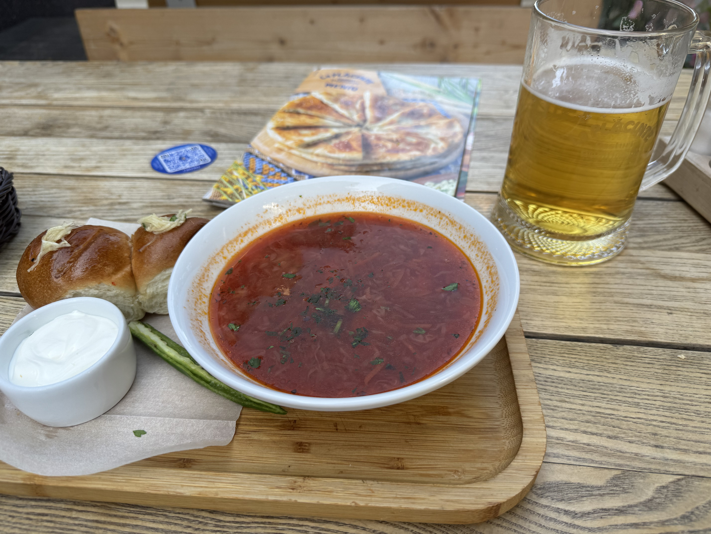

Som den tognerden jeg er så må jeg ta en tur innom Chisinau sin togstasjon. Igjen så har de moderne togstasjonene noe lære fra arkitekturen til de gamle togstasjonene.

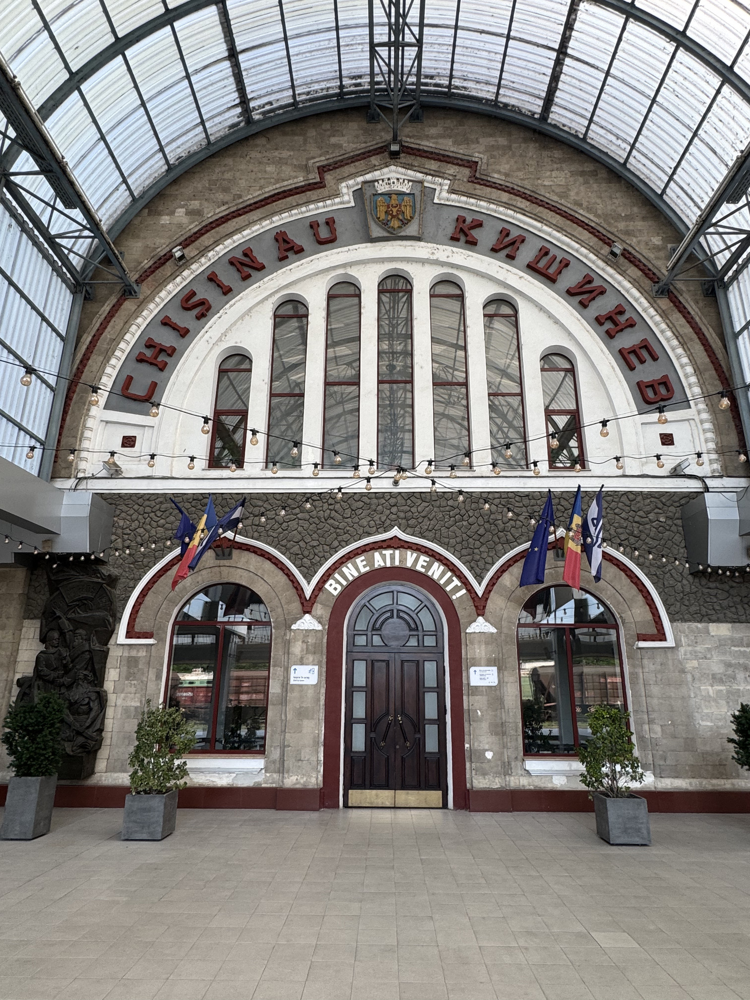

Bare å plukke og velge mellom hvor man vil dra! Tror jeg står over Kiev...

Med det er tiden min i Moldova over, et land som jeg anbefaler på det sterkeste å besøke før de blir en del av EU. Tenk deg et land med sydenvarme, ingen turister, vakker natur og interresant historie, kan det bli bedre?

[Ne vedem la Luxemburg!](/topper/38_luxembourg)

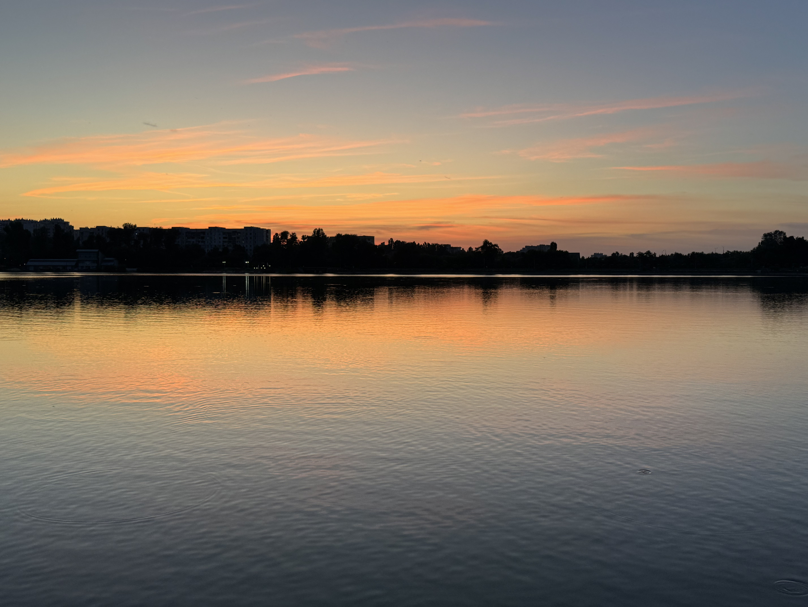