# Vaalserberg, Nederland, 322 moh

_Gjennomført fra 06.06.2025 til 08.06.2025_

Hallo!

Velkommen til bestigningen av den høyeste toppen til det laveste landet i Europa, som er Nederland med toppen Vaalserberg på 322 moh! Teknisk sett er det høyeste punktet til Nederland Mount Scenery på 887 moh, men den toppen befinner seg på en øy i Karibia, ikke i det geografiske Europa. 

Vaalserberg befinner seg på treriksgrensa mellom Nederland, Belgia og Tyskland, helt sør-øst i Nederland. Derfor er det faktisk lettere å komme seg til toppen fra Tyskland siden storbyene Dusseldorf og Køln ligger relativt nerme toppen.

Vi starter derfor reisen med fly til Dusseldorf og tog videre til Køln langs Rhinen.

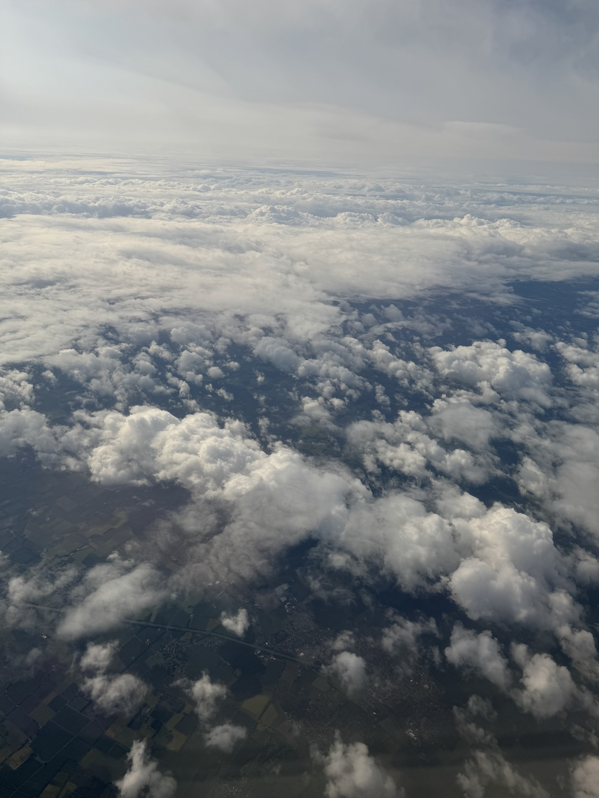

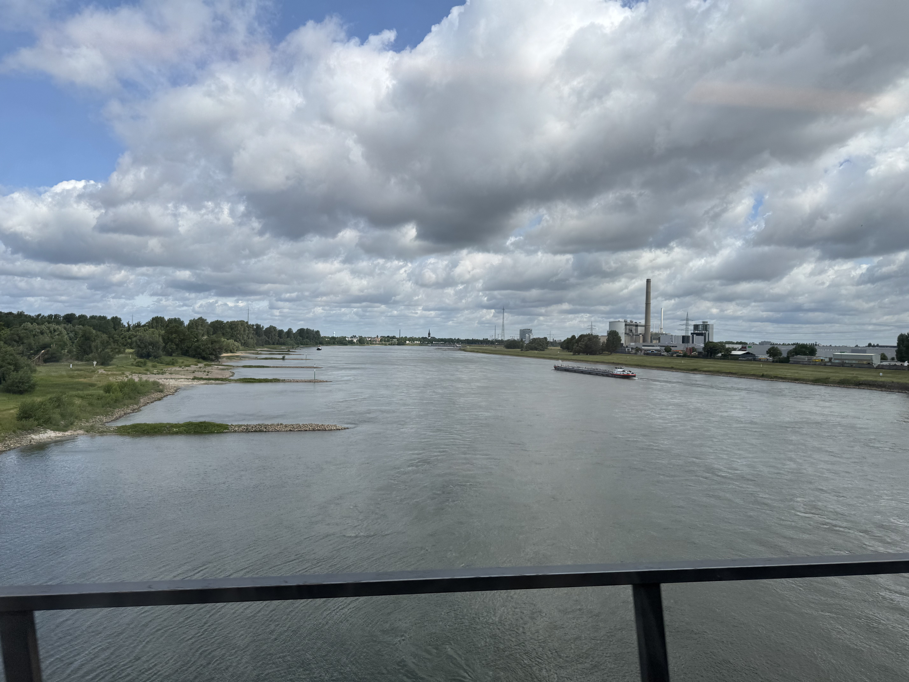

Lykke til med å finne riktig tog på egenhånd.

Velkommen til Køln Hauptbanhof!

Det er i Køln hvor neste års mote blir satt.

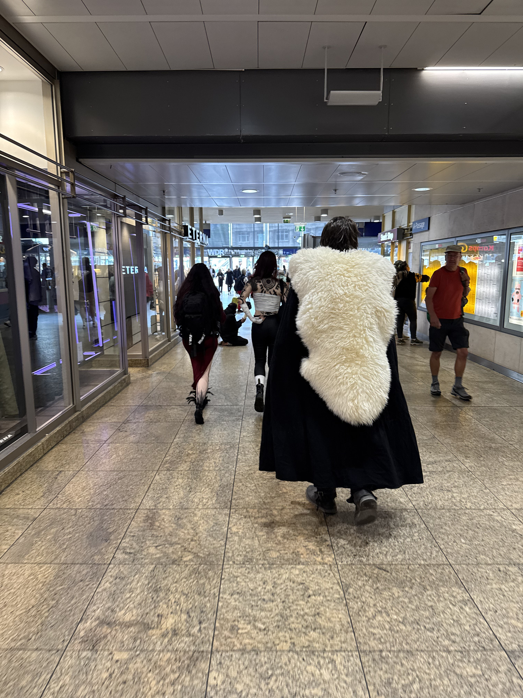

Siden jeg bruker Køln som base for Nederlands høyste topp gir det meg en god mulighet til å utforske byen på Rhinen.

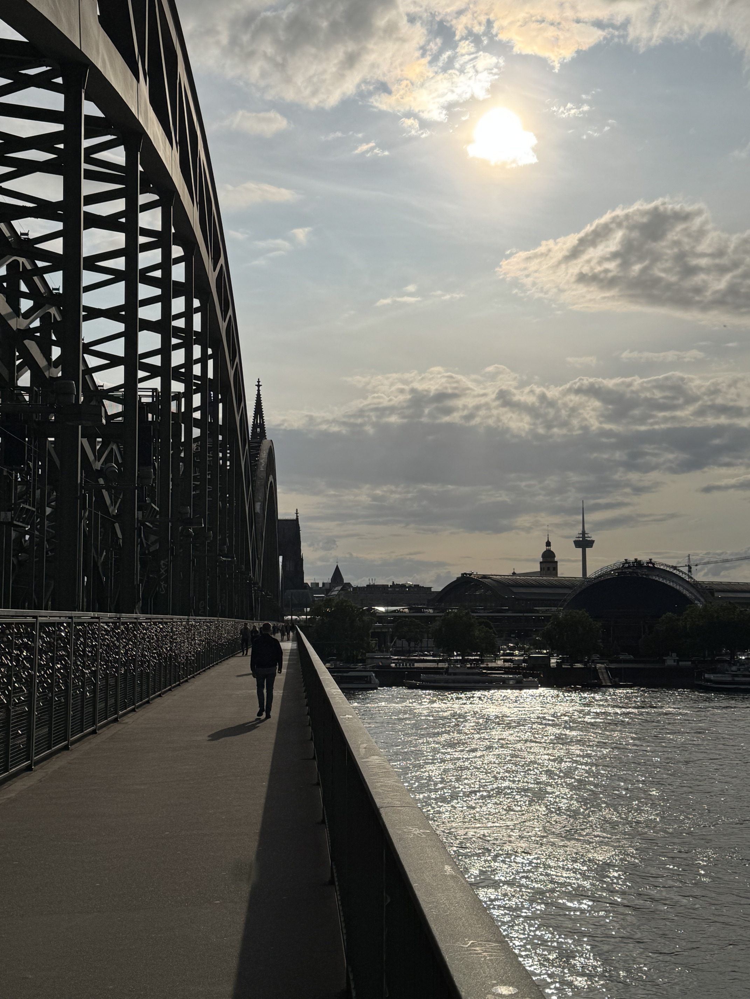

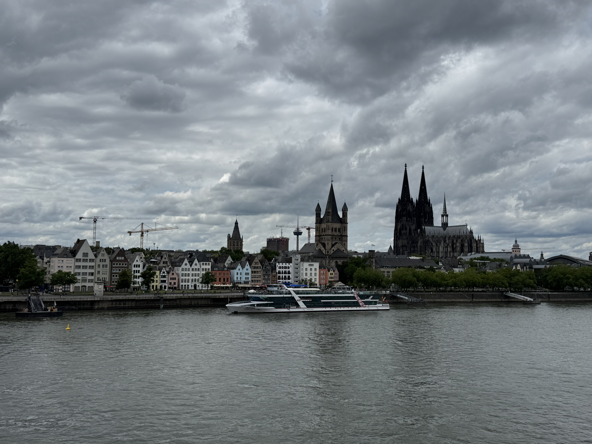

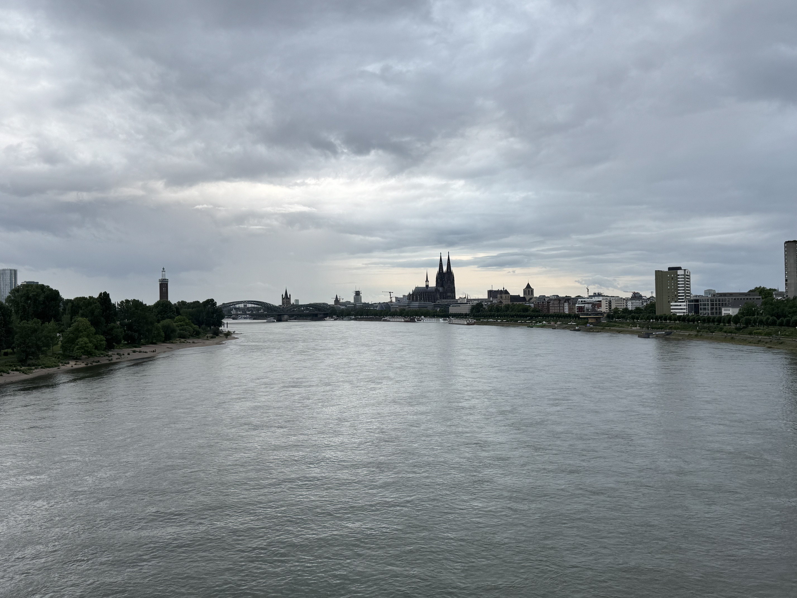

Hvis man er usikker på hva man vil ha til middag, så er alltid currywurst og en weissbier en god backup mens man sitter og ser på kanalbåtene gli forbi.

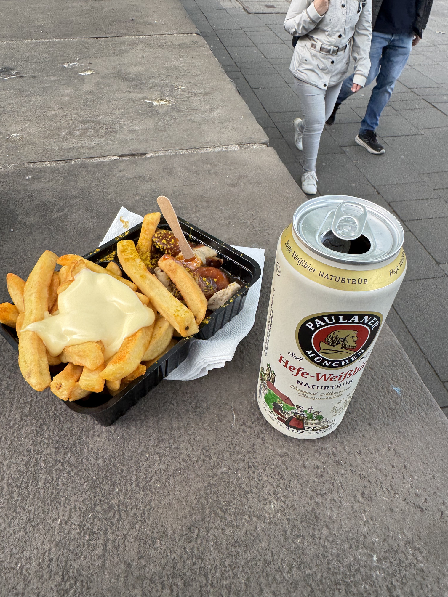

Køln er også det perfektet stedet for de som elsker både kanalbåter og festing. Jeg følte ikke trangen for å være med ombord og satt helder å observerte på elvebredden.

<video controls>
  <source src="/41_nederland/teknobåt.MP4" type="video/mp4">
</video>

Etter en dag med kanalbåter, øl, currywurst og en natt på hotell går turen mot Nederlands høyeste punkt. For å nå den fra Køln må man først ta tog 1 time vest til byen Aachen rett ved grensa til Nederland, hvor man så er relativt nerme toppen. Turen mot Aachen starter på Køln Hauptbanhof!

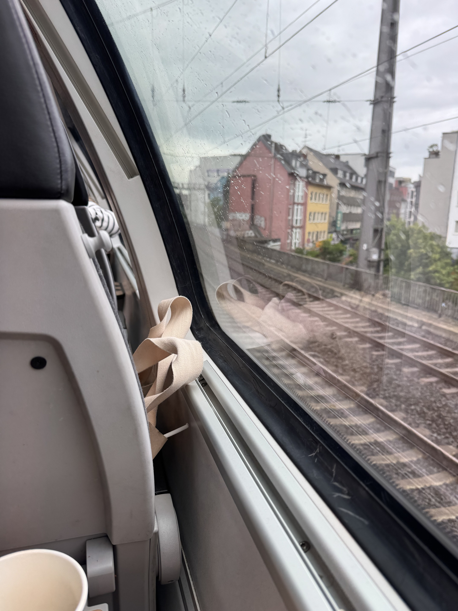

Velkommen til Aachen!

Fra Aachen er det kun et par stopp på lokalbussen før man begynner å gå mot toppen.

Og etter ca. 30 minutter gåing så er man ved Nederlands høyeste punkt, Vaalserberg på 322 meter over havet!

Toppen ligger også rett ved treriksgrensa til Belga, Nederland og Tyskland, så det gjør det jo ekstra kult... selv om noen har rivd ned flagget til Tyskland.

Belgia!

Nederland!

Tyskland!

Fra toppen velger jeg heller å gå hele veien ned til Aachen gjennom en annen rute istedenfor å ta buss.

Aachen er også en veldig fin by som anbefales å besøkes hvis man er i Køln. Hvis man også er toginteressert så finnes drømmebutikken her. Må være årlig i å si at jeg likte den butikken veldig godt.

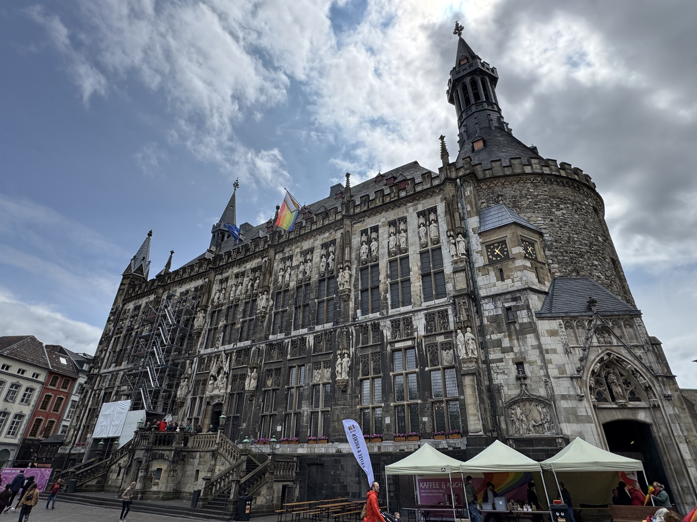

Aachen leverer også godt på de Tyske stereotypene. Her har man både turister som går i sokker og sandaler, samt tekno elskere som kjemper for samfunnet på sine måte.

<video controls>
  <source src="/41_nederland/demonstrasjon.mp4" type="video/mp4">
</video>

Etter en dag i Aachen går turen tilbake til Køln og hjemover mot Oslo.

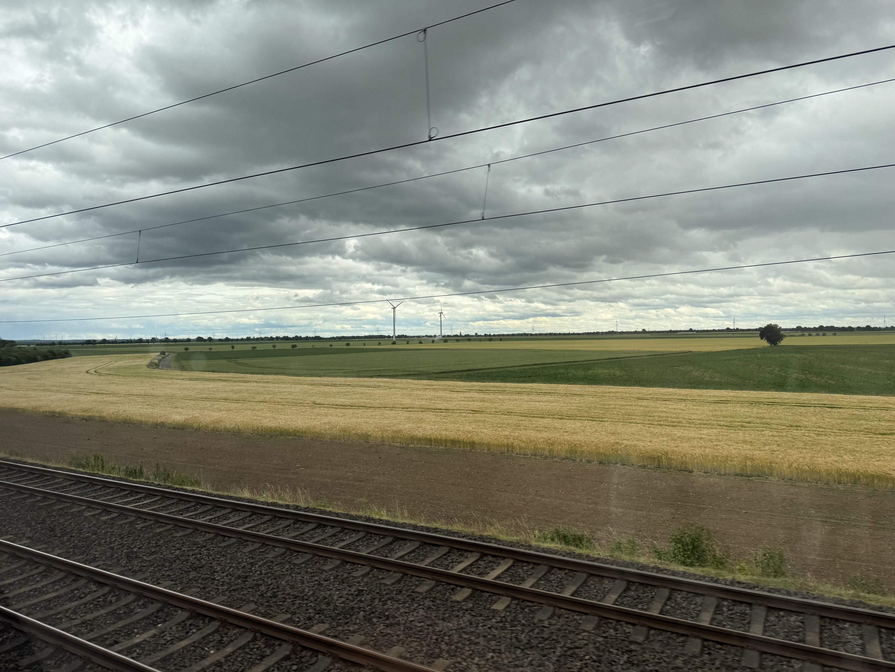

[Tot ziens in Moldavië!](/topper/39_moldova)

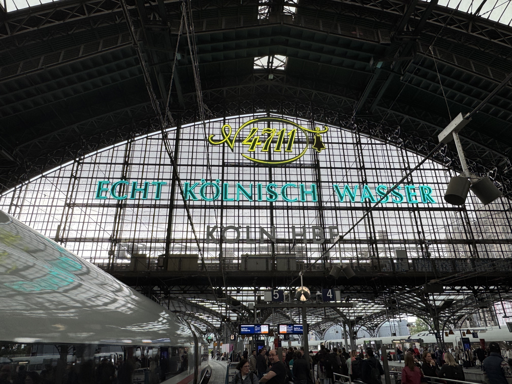

