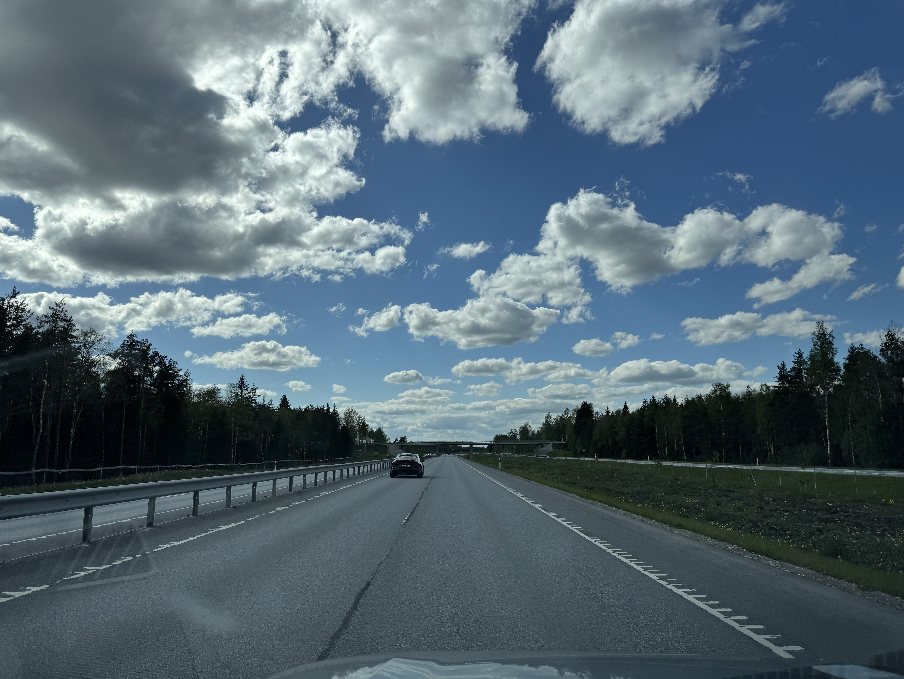
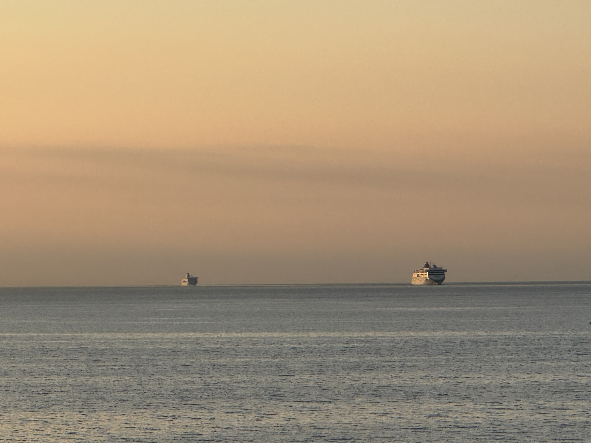
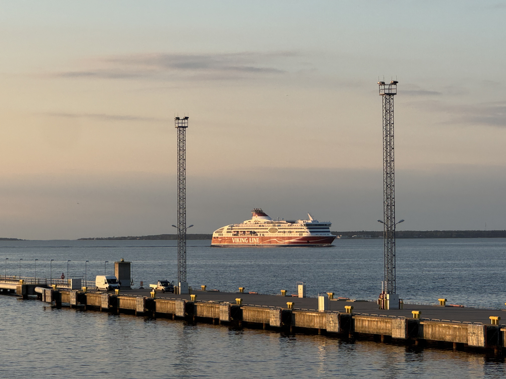
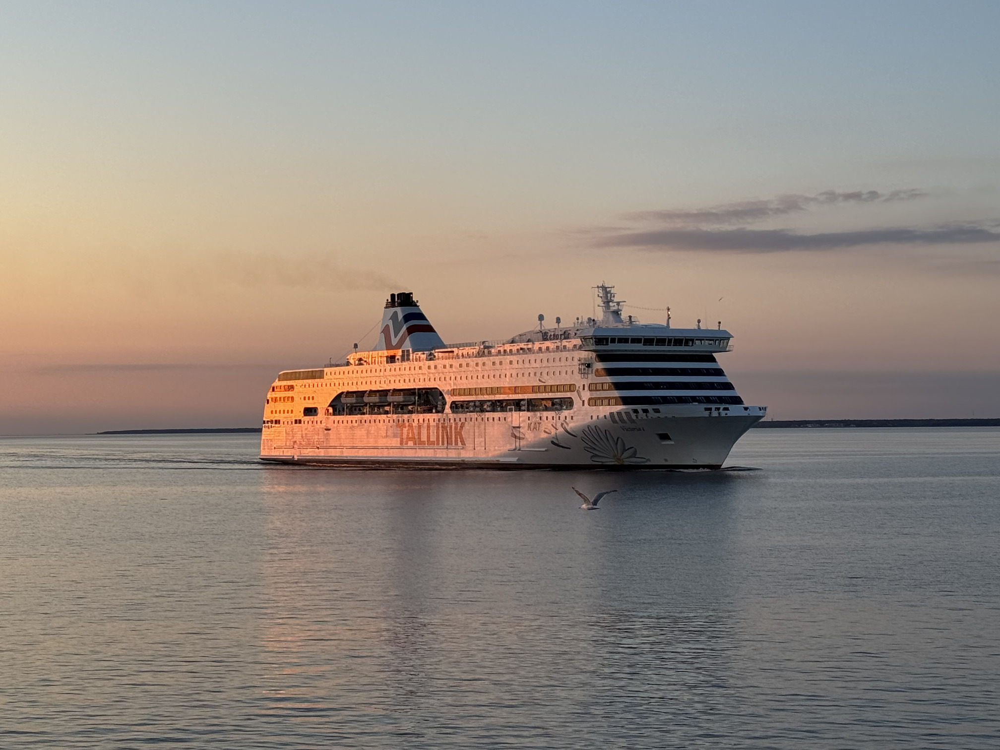
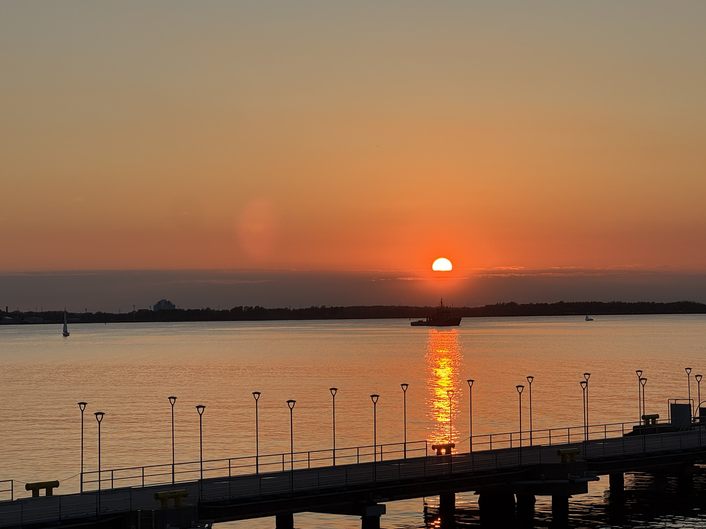

# Suur Munamägi, Estland, 318 moh

_Gjennomført fra 23.05.2025 til 26.05.2025_

Dette er tredje episode i en tre episoders serie der jeg tar alle av baltikum sine topper i samme tur. Dette fordi baltikum sine land (Litauen, Latvia og Estland) ligger i perfekt rekkefølge for å ta i en smekk!

Resten av episodene kan du finne her:
- [Episode en: Aukštojas, Litauen, 294 moh](/topper/44_litauen)
- [Episode to: Gaiziņkalns, Latvia, 312 moh](/topper/43_latvia)

---

Tere!

Da er det enedlig på tide å bestige den siste toppen i baltikum, nemlig Estland sin høyeste topp, Suur Munamägi på 318 moh. Estland finner man på andre siden av Østersjøen for Finland og Sverige, hvor toppen er rett på andre siden av grensen med Latvia i Võru fylke.

Turen til Estland's høyeste topp starter etter en natt i Madona etter å ha bestegeget Latvia sin høyeste topp. Endelig er også været blitt bedre!

På butikken i Madona hvor jeg bare prøvde å fikse noe frokost fikk jeg voksenkjeft av en eldre herre... på latvisk. Jeg aner ikke hva han var irritert over, men før jeg fikk sagt at jeg ikke forstår latvisk forsvant han. Heldigvis klarer jeg å finne litt frokost og turen fortsetter mot den Estlandske grensen.

Velkommen til Estland!

Fra grensen er det kort tid før man tar av veien mot Suur Munamägi.

Og etter 10 minutter kjøring finner jeg meg ved foten av toppen. En liten fun fact er at "Suur Munamägi" oversettes til "Stort egg fjell", navnet har det fått fordi fjellet ser ut som et egg. Jeg lurte på hvorfor det var så mange små statuer av egg overalt ved toppen.

Fra foten av det store egg fjellet er det ca. 10 minutter gåing før man når toppen.

Og vipps så er Estland's høyeste fjell, Suur Munamägi på 318 meter over havet besteget! Det er noe med landene i baltikum og tvangen etter å putte et tårn på toppen av toppene deres.

Beklager at det ikke er mer bilder av utsikten. Det var bokstavelig talt som å stå i midten av Nordmakra, bare masse furuer så langt øye klarte å se.

Med litt trasking rundt i furu skogen på egg-fjellet er det på tide på bevege seg mot Tallin. Som betyr å krysse hele Estland med bil.

Etter ende fler timer i bil kan jeg endelig levere fra meg leiebilen og si at jeg er i Tallinn.

Jeg har en natt i Tallinn før jeg reiser hjem og har derfor litt tid til å utforske byen.

Putin er ikke særlig populær i Tallinn.

Ikke vanskelig å forstå at mange forbinder Tallinn med ferger og harryhandel.

[Näeme jälle Hollandis!](/topper/41_nederland)

