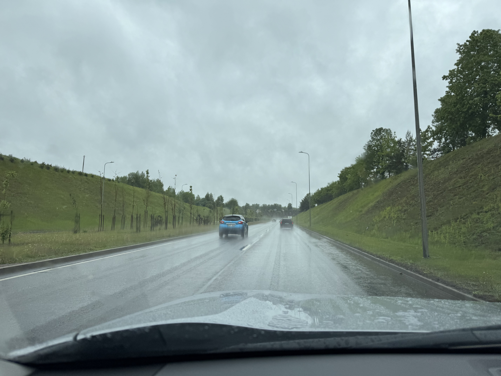
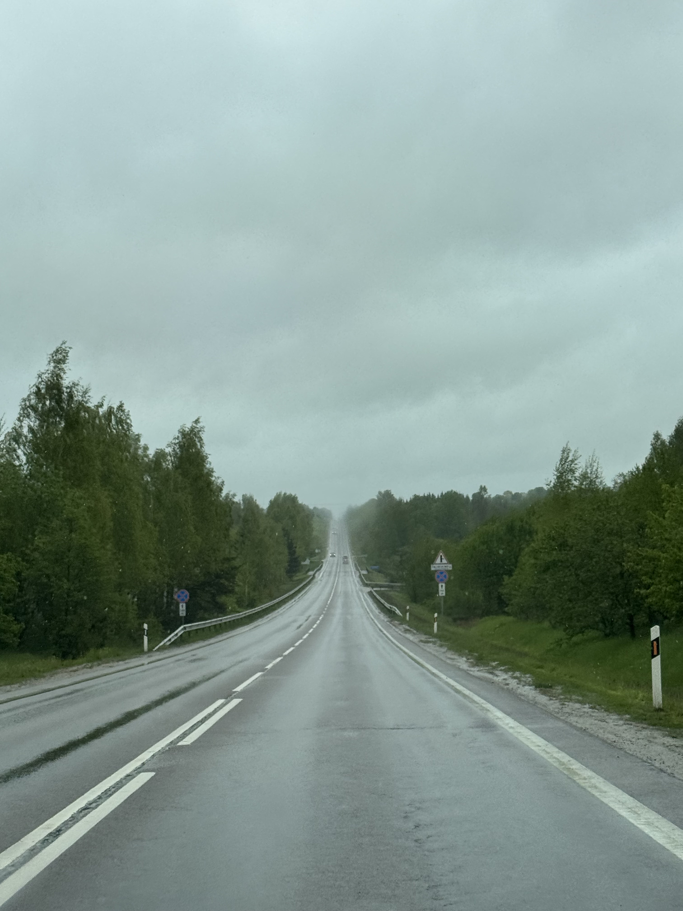
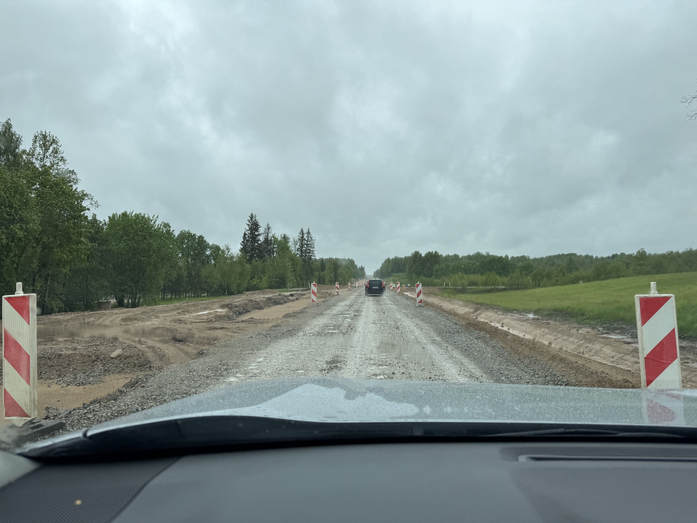
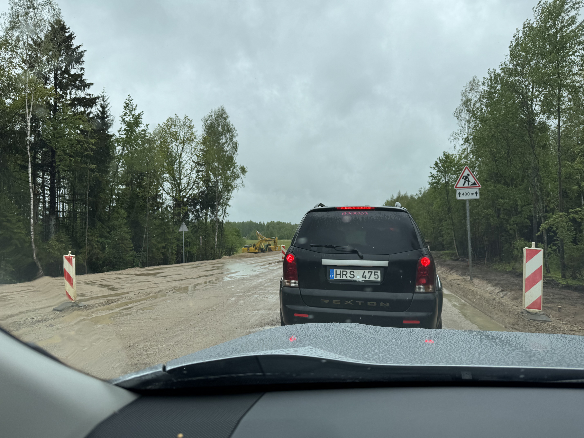
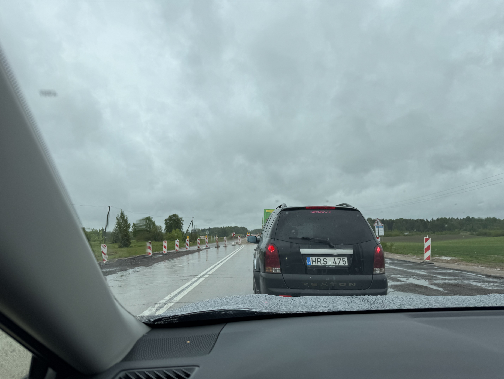
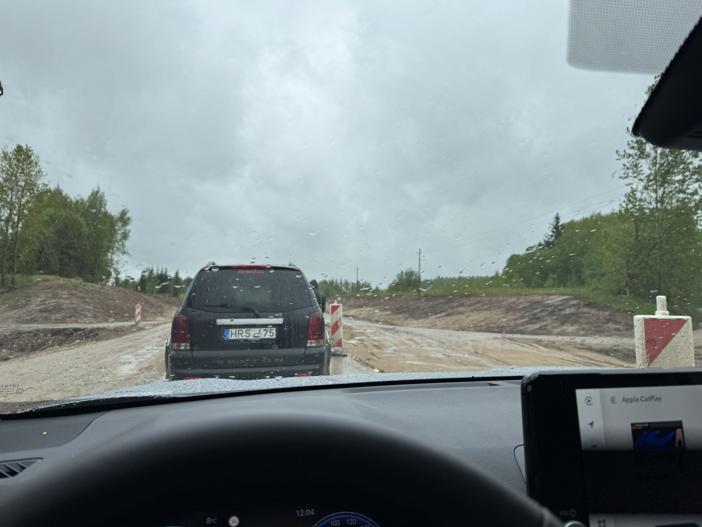
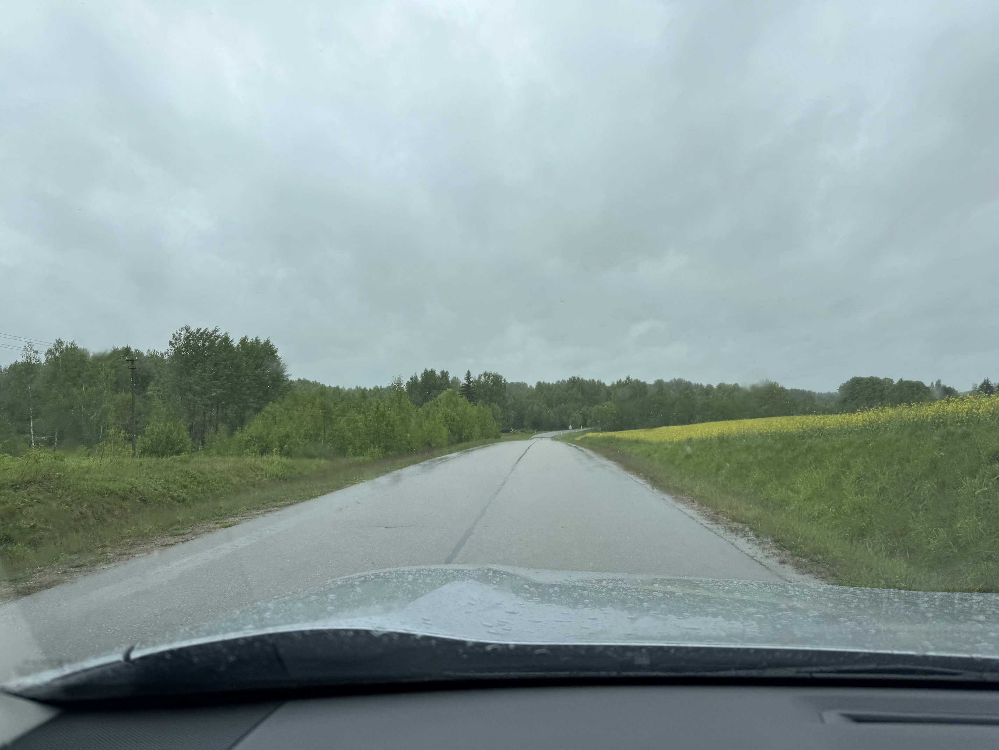
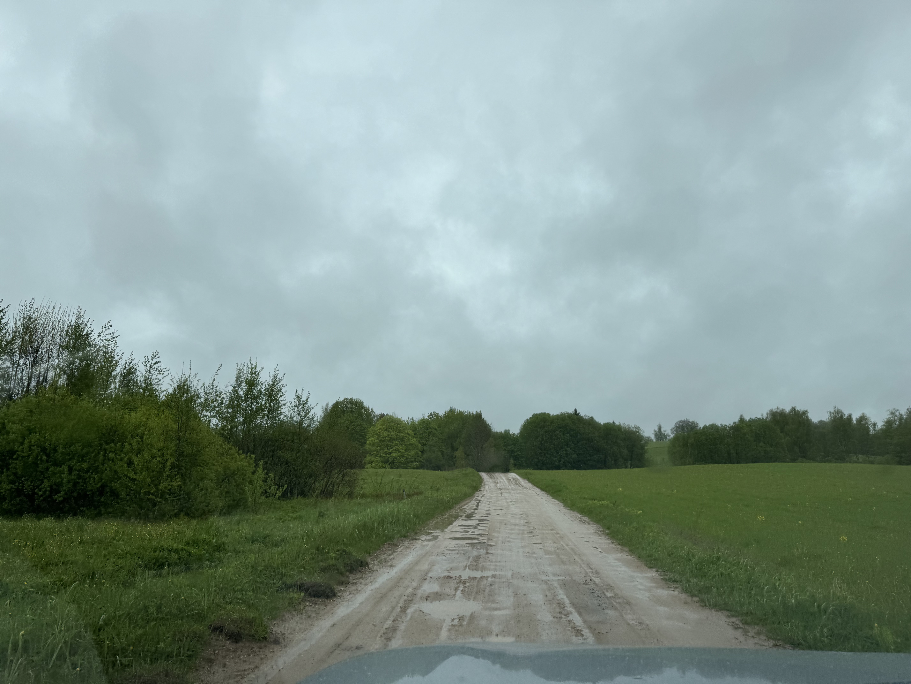

# Gaiziņkalns, Latvia, 312 moh

_Gjennomført fra 23.05.2025 til 26.05.2025_

Dette er andre episode i en tre episoders serie der jeg tar alle av baltikum sine topper i samme tur. Dette fordi baltikum sine land (Litauen, Latvia og Estland) ligger i perfekt rekkefølge for å ta i en smekk!

Resten av episodene kan du finne her:
- [Episode en: Aukštojas, Litauen, 294 moh](/topper/44_latvia)
- [Episode tre: Suur Munamägi, Estonia, 318 moh](/topper/42_estland)

---

Sveiki!

Velkommen tilbake på denne trioen av topper i baltikum, hvor det nå er Gaiziņkalns i Latvia på 312 moh sin tur til å bli bestiget. Latvia ligger mellom Litauen og Estland hvor vi finner Gaiziņkalns øst for Riga ved byen Madona, midt i Latvia.

Vi starter turen mot Gaiziņkalns i Vilnius etter å ha tatt Litauen sin høyeste topp.

La meg fortelle litt om hvordan veiarbeid utføres i Litauen. Istedenfor å lage en ny midlertidlig vei for at veiarbeidet kan utføres fritt, så lysreguleres 1 felt av veien, slik at man kun jobber på 1 felt av gangen. I tillegg har de bestemt seg for at lyset skal være grønt i 1 minutt, mens det er rødt i 8 minutter. I TILLEGG så er ingen av disse lysreguleringene timet, så man treffer rødt lys HVER. JÆVLA. GANG.

La veiearbeidet begynne...

Venting...

... venting...

... venting...

... venting...

... oooog der gikk jeg lei ja. På tide å finne en annen vei til Latvia.

Men etter en del timers kjøring er man endelig framme ved den Latviske grensen.

Etter å ha krysset grensen til Latvia så er det et par timer til med kjøring før jeg tar av veien mot toppen.

Endelig er toppen i sikte!

Fra parkeringen er det ca. et kvarter å gå før Latvia's høyeste punkt Gaiziņkalns på 312 meter over havet er bestiget!

Kanskje jeg må ta en tur tilbake for å teste ut skianlegget på Gaiziņkalns.

En god del regn og vind gjør besøket på toppen kortvarig og jeg beveger meg rask tilbake til leiebilen. Turen går så videre til overnattingen i Madona og videre Estland sin høyeste topp.

[Uz tikšanos Igaunijā!](/topper/42_estland)

