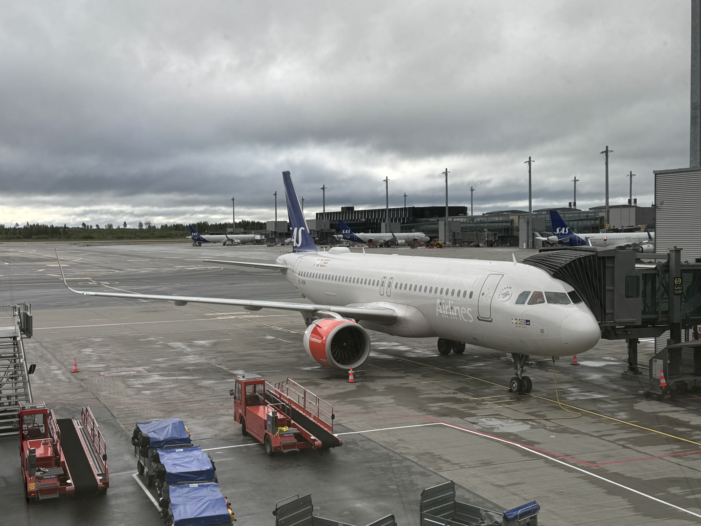
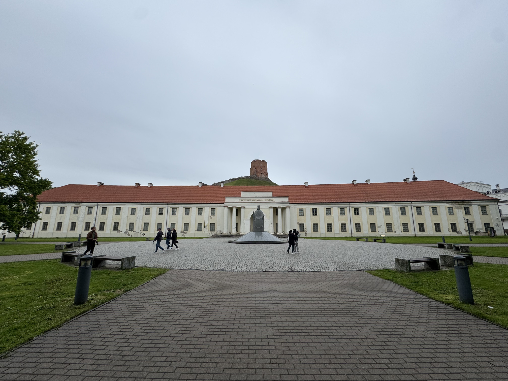
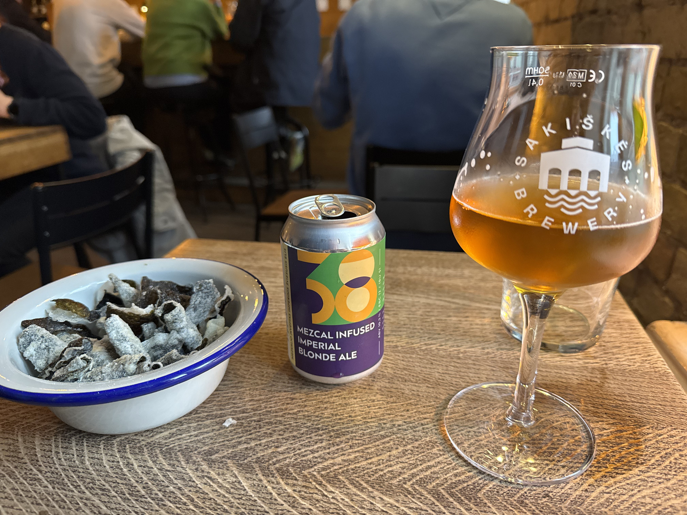
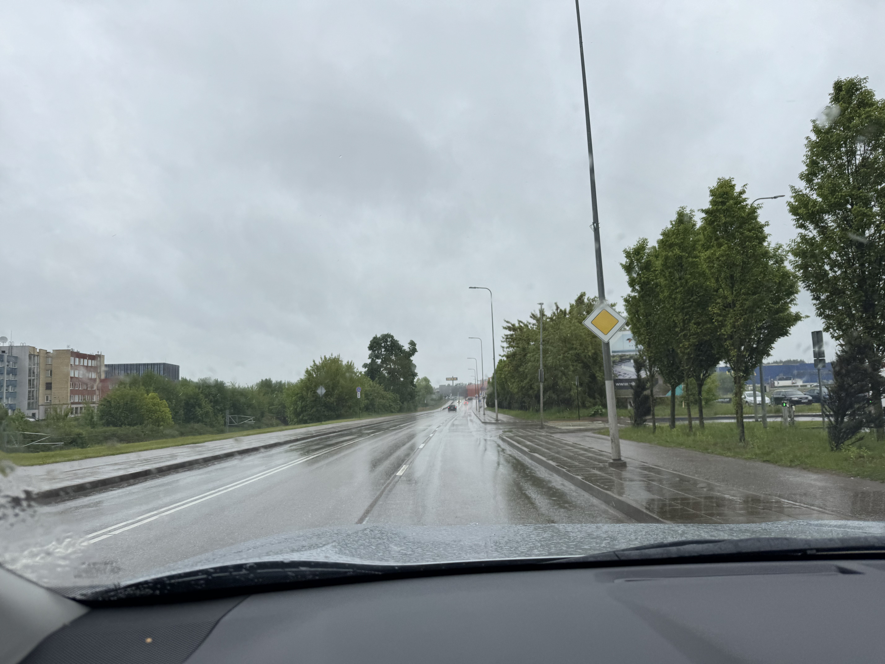
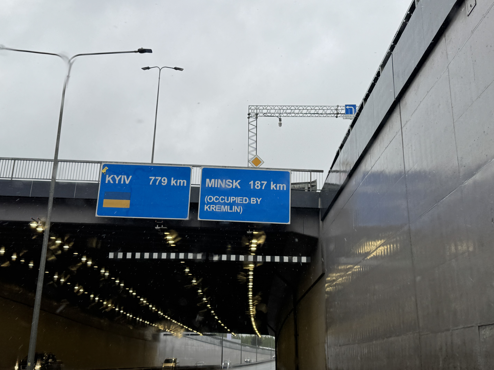
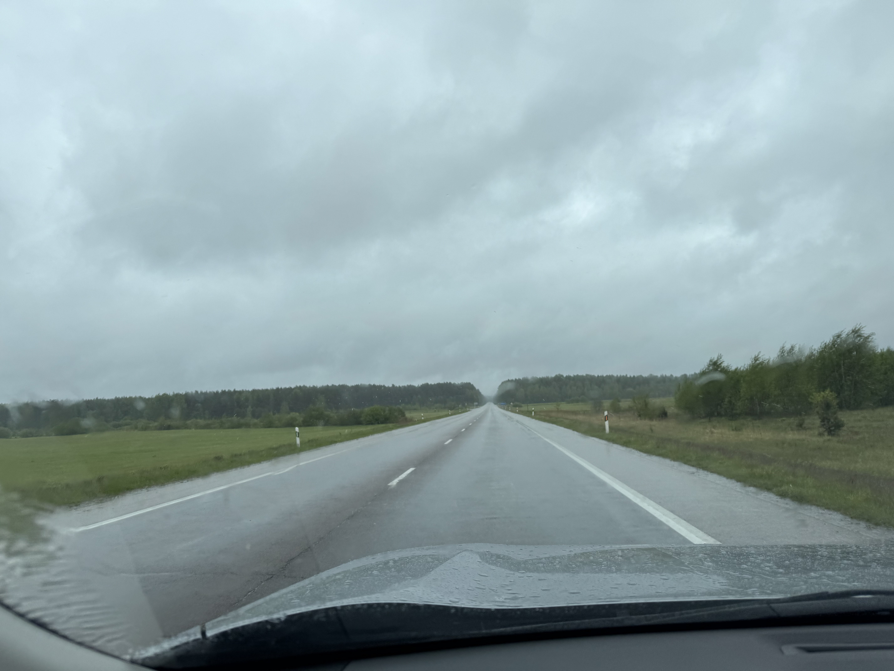
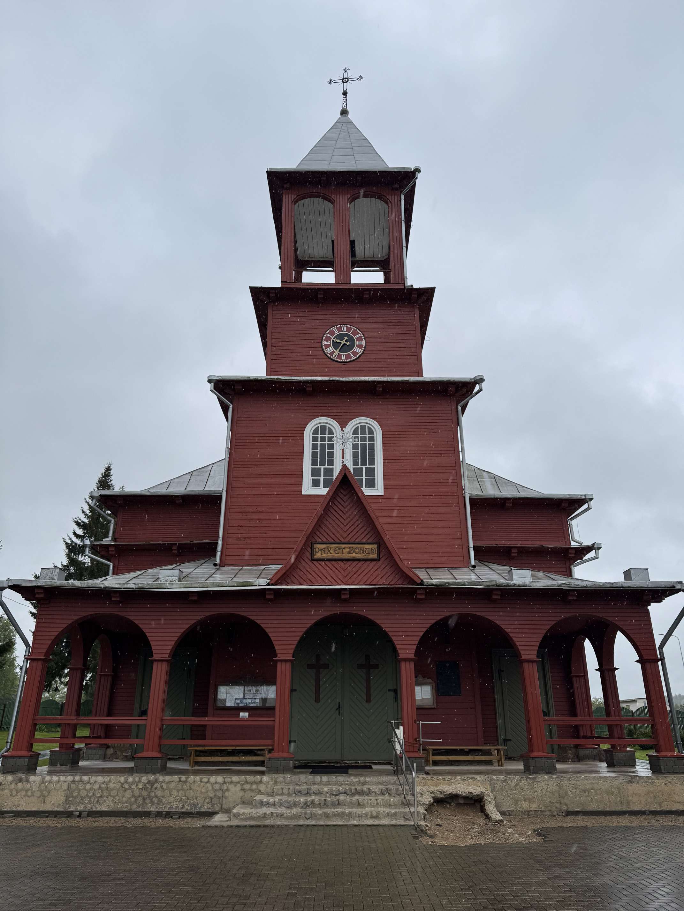
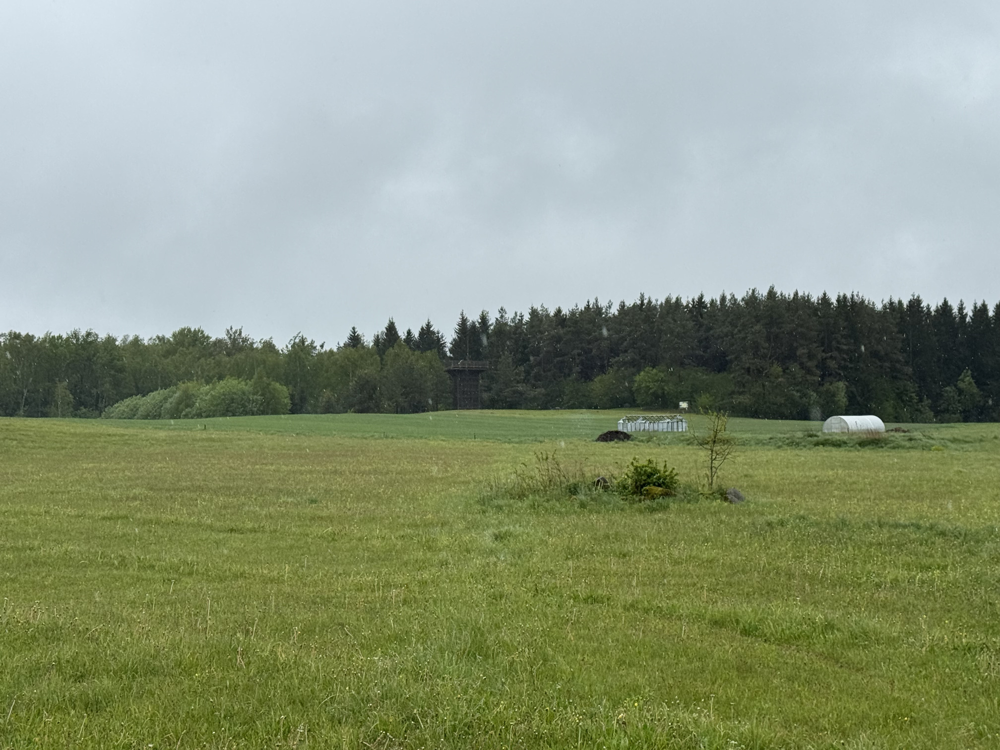
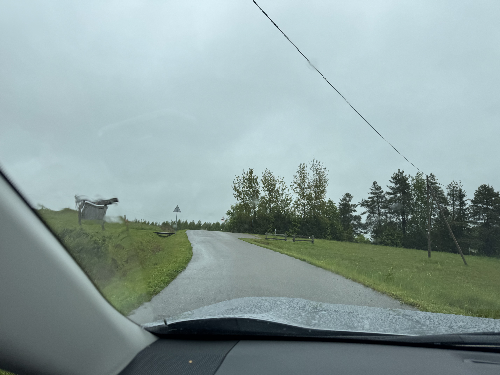

# Aukštojas, Litauen, 294 moh

_Gjennomført fra 23.05.2025 til 26.05.2025_

Dette er første episode i en tre episoders serie der jeg tar alle av baltikum sine topper i samme tur. Dette fordi baltikum sine land (Litauen, Latvia og Estland) ligger i perfekt rekkefølge for å ta i en smekk!

Resten av episodene kan du finne her:
- [Episode to: Gaiziņkalns, Latvia, 312 moh](/topper/43_latvia)
- [Episode tre: Suur Munamägi, Estonia, 318 moh](/topper/42_estland)

---

Sveiki!

Ny uke, ny topp og denne gangen er den Litauen sin topp Aukštojas på 294 moh som skal erobres. Litauen er et av landene i baltikum og ligger mellom Polend, Belarus og Latvia. Aukštojas finner vi ca. 30 minutter øst for Vilnius i Medininkai regionen, rett ved grensen til Belarus.

Turen mot toppen starter med et hopp over til Vilnius.

Velkommen til Vilnius, Litauen's hovedstad! Skulle nesten tro at vi har landet på en togstasjon, men dette er faktisk ankomstbygget til Vilnius lufthavn. Her har vi i resten av Europa noe å lære.

Før reisen går mot Litauen sitt høyeste punkt tilbringes det en natt på hotel i Vilnius. Som gir en fin mulighet til å utforske byen.

Helt tilfeldigvis kom jeg over en øl-festival...

... som naturligvis gjorde meg tørst.

Men nok morro! Nå er det på tide å bevege seg mot Aukštojas. I de baltiske landene er det bil som gjelder, selv om toppen bare ligger 30 minutter øst for Vilnius så ville det tatt flere timer med kollektiv for å komme seg dit. For å ikke tenke på resten av toppene i de andre landene i baltikum. Dermed starter turen på Vilnius lufthavn for å hente leiebil som skal ta meg videre til Aukštojas og resten av toppene i baltikum.

Er ikke veldig vanskelig å forstå hvilken side av Ukraina konflikten Litauen stiller seg bak.

Etter en halvtime er Litauen sitt høyeste punk i siktet.

Hvis noen lurte på hvilken vei man må gå.

Etter 10 minutter på beina er vi framme ved Litauens høyeste punkt, Aukštojas, 294 meter over havet!

Med litt tid brukt i de Litauske høydene går turen rett videre til Latvia sitt høyeste punkt.

[Iki pasimatymo Latvijoje!](/topper/43_latvia)

