# Ta' Dmejrek, Malta, 253 moh

_Gjennomført fra 11.05.2025 til 12.05.2025_

Bongu!

Endelig er det tid for et nytt land og en ny topp, hvor det denne ganger er Malta som står for tur og toppen Ta' Dmejrek på 253 moh. 
Malta er en øynasjon som befinner seg midt i middelhavet mellom Sicilia og Libya, og Ta' Dmejrek ligger i Dingli distriktet rett ved Dingli cliffs.

Vi starter reisen til Malta på Oslo lufthavn hvor første fly går til Munchen.

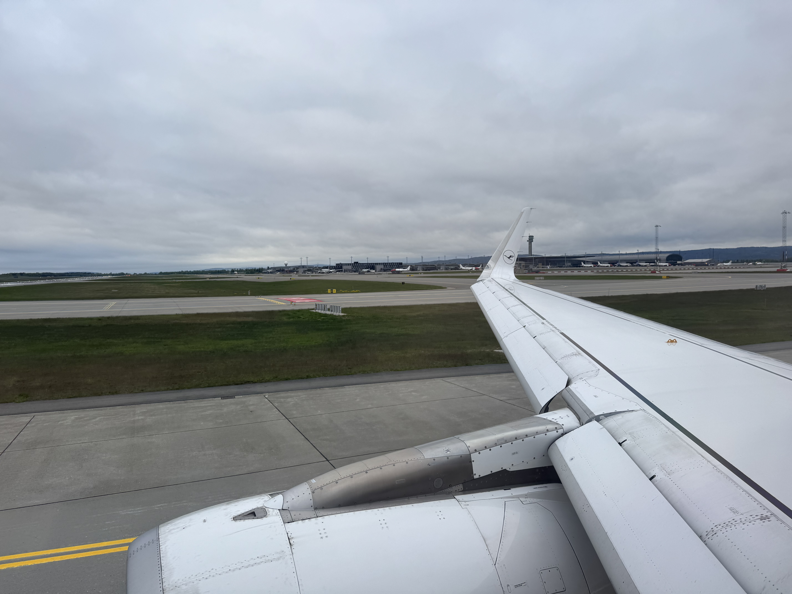

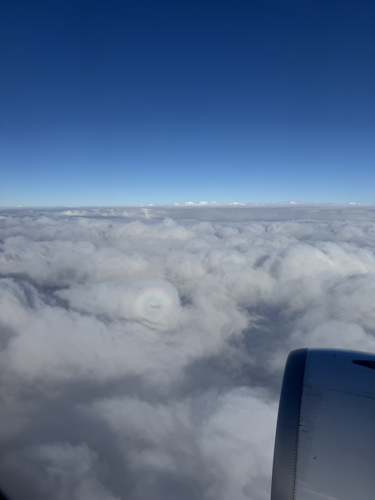

Etter et kort stopp i Munchen går det videre til Malta over alpene, hvor vi flyr med Malta sitt nasjonale flyselskap. Må si det er litt kult å få prøve flyselskaper som kun innbyggerne av landet bruker, hvor klappingen går høyt etter landing på en vindutsatt rullebane.

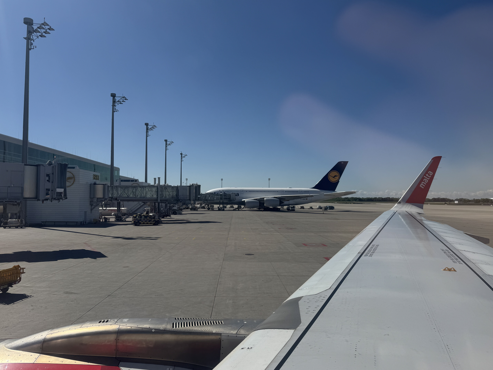

Velkommen til Malta!

Som vanlig har jeg alt for lite tid i landet jeg besøker, så turen går direkte videre til Ta' Dmejrek fra flyplassen.

Fra flyplassen går det videre med lokalbuss mot den sørlige kysten av Malta og busstoppet med det kreative navnet "Cliffs".

Forresten så er jeg overrasket over at Malta ikke har noe kjente Formel 1 sjåfører, for på denne og andre buss/taxi turerne gikk det _sabla fort_ rundt svingene! Jeg er helt sikker på at bussene ikke var et kvarter forsinket, de var 45 minutter tidlig ute!

Fra busstoppet er det ca. 15 minutter å gå tilbake veien vi kom mot Ta' Dmejrek.

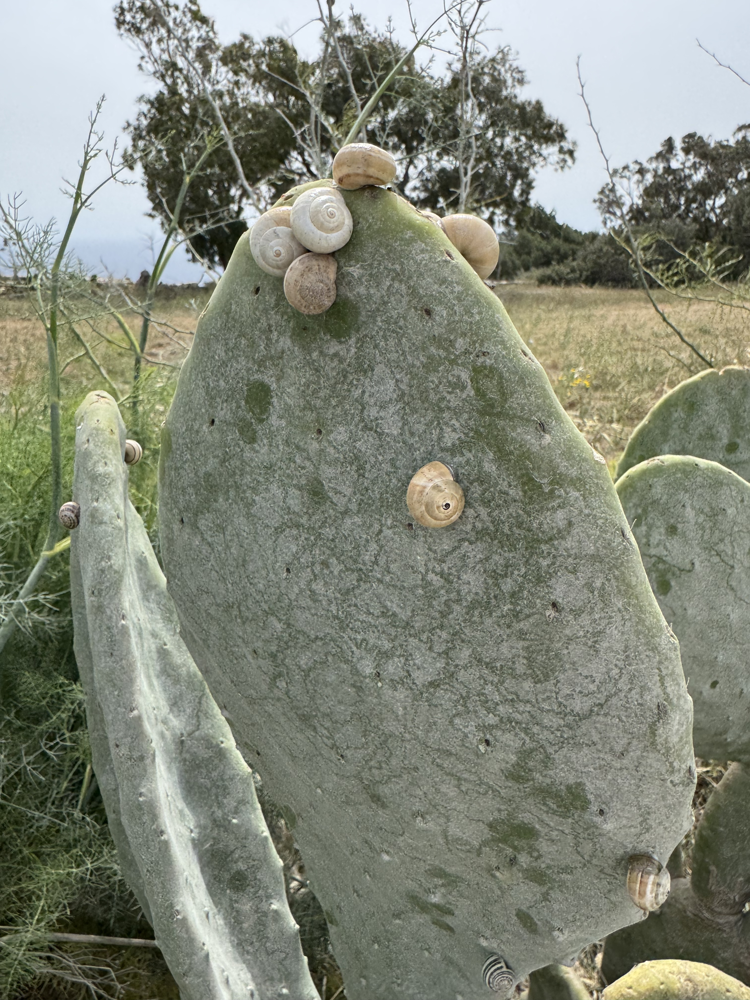

Etter 15 minutter står vi foran Malta sin høyste topp Ta' Dmejrek på 253 moh.

Og vipps så er vi på Malta sin høyeste topp!

Heldigvis ligger Ta' Dmerjek kun et steinkast unna de spektakulære klippene på sørlige Malta, dermed er det ikke langt til utrolig kul natur. Det er slike "gjemte perler" som gjør at synes det er skikkelig kult å dra på disse turene.

Her bodde også mange fugler som bruker klippene som hjem mens de ikke er på havet å fisker.

Fra klippene på sørsiden er det ca 30 minutter til Malta sin hovedstad Valetta, eller 15 minutter med enda en av Malta sine fremtidige Formel 1 sjåfører. I Valetta tilbringer jeg en natt på hotel og forsetter å nyte den siste lille tiden jeg har på Malta.

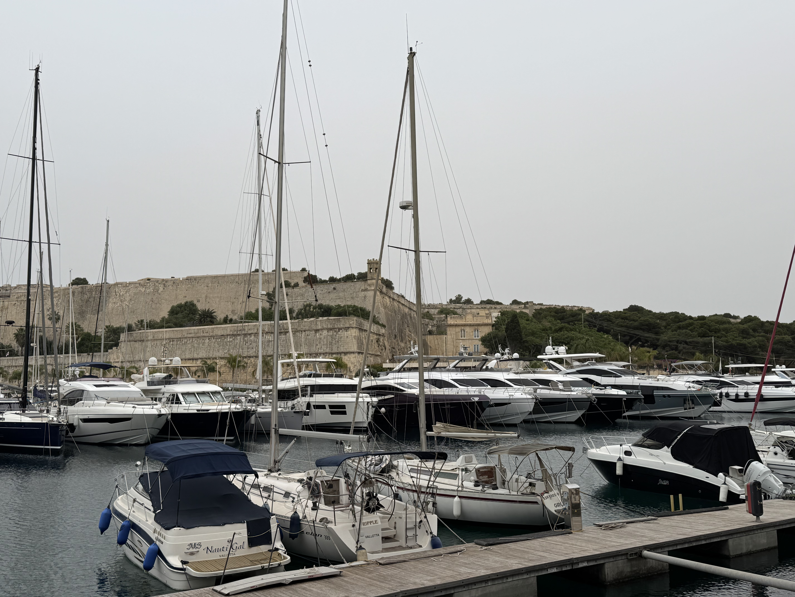

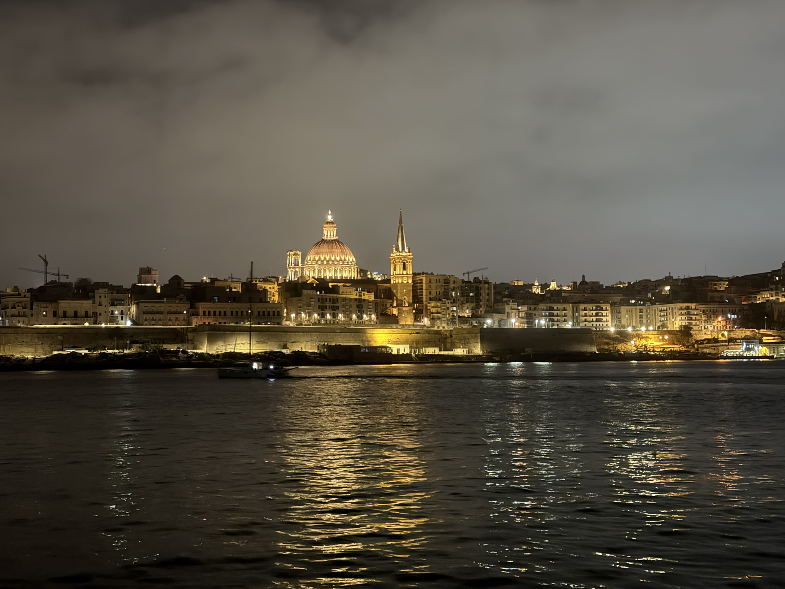

Sicilia neste!

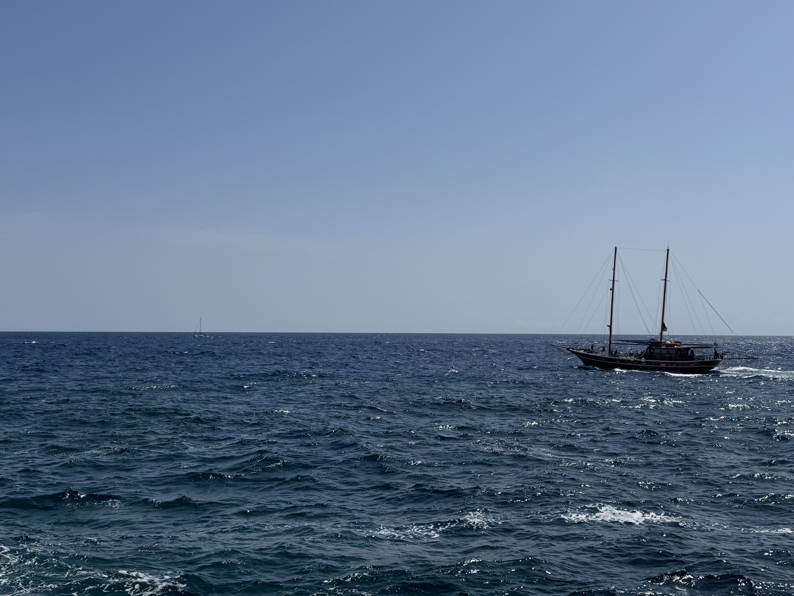

Men etter alt for liten tid er det på tide å dra hjemover til Norge igjen. Malta er definitivt et land jeg må dra tilbake til; naturen, de avslappa folka og rolige steder som ikke var turistifisert til hundre og helvete var skikkelig deilig.

Det går heller ikke noe direktefly tilbake til Oslo, så her må jeg belage meg på et stopp i København.

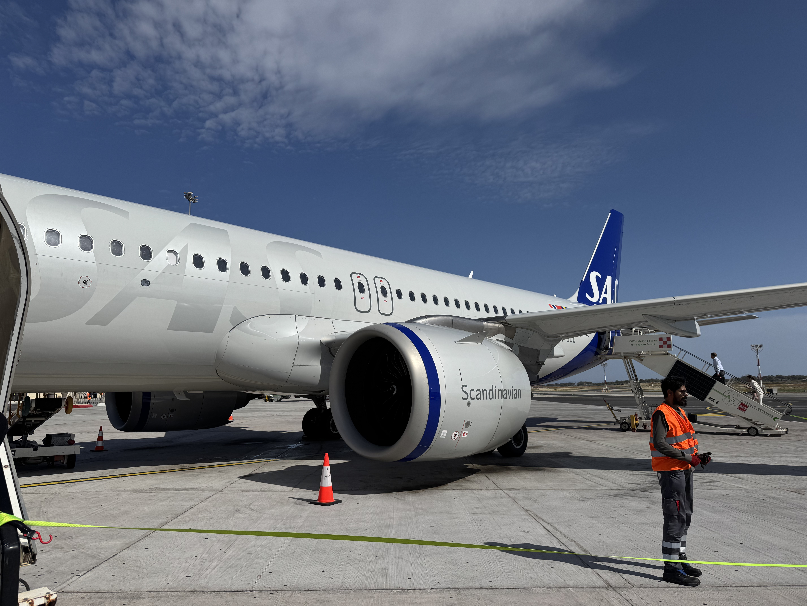

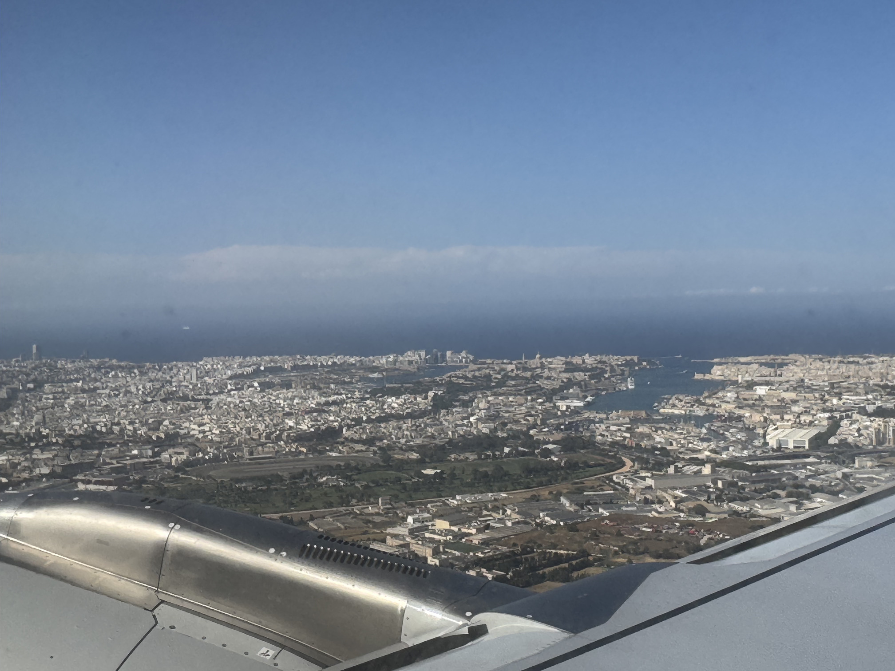

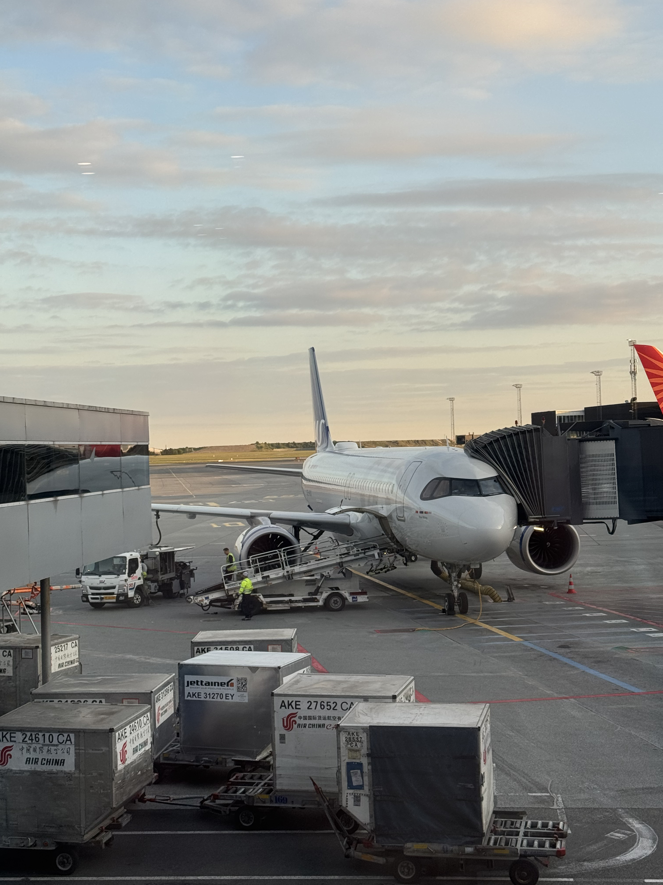

[Narawkom fil-Litwanja!](/topper/44_litauen)

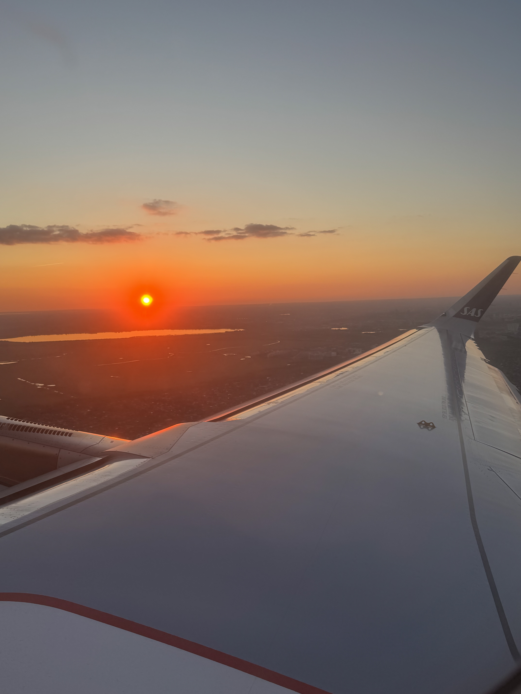