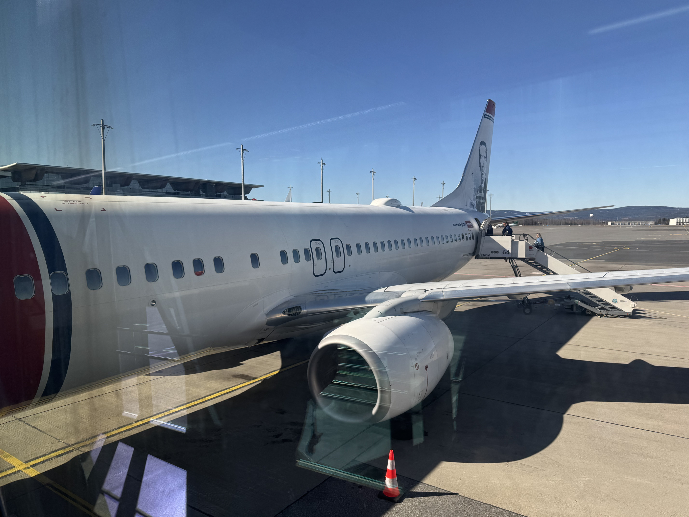
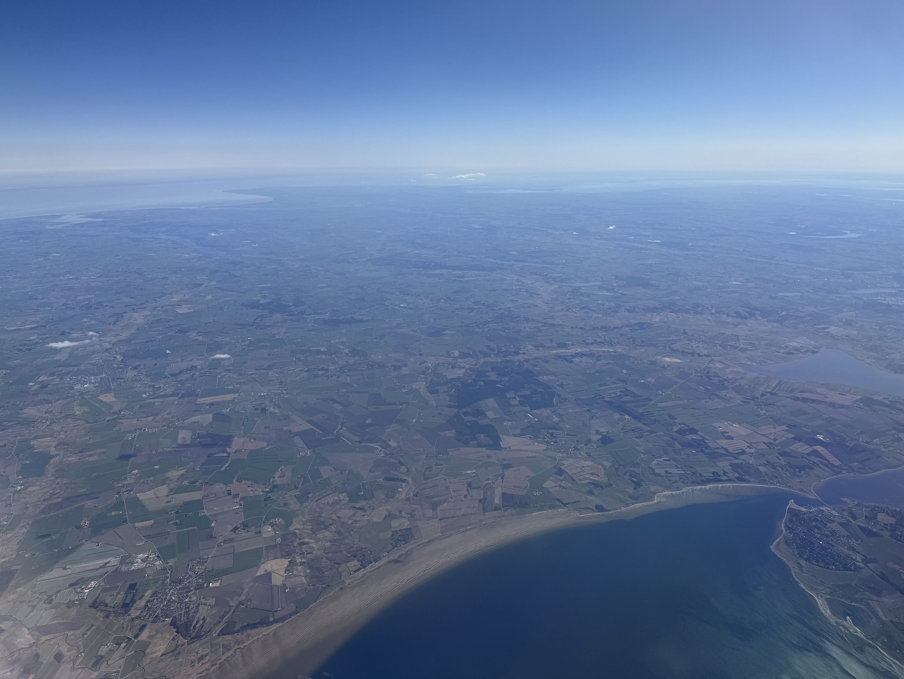
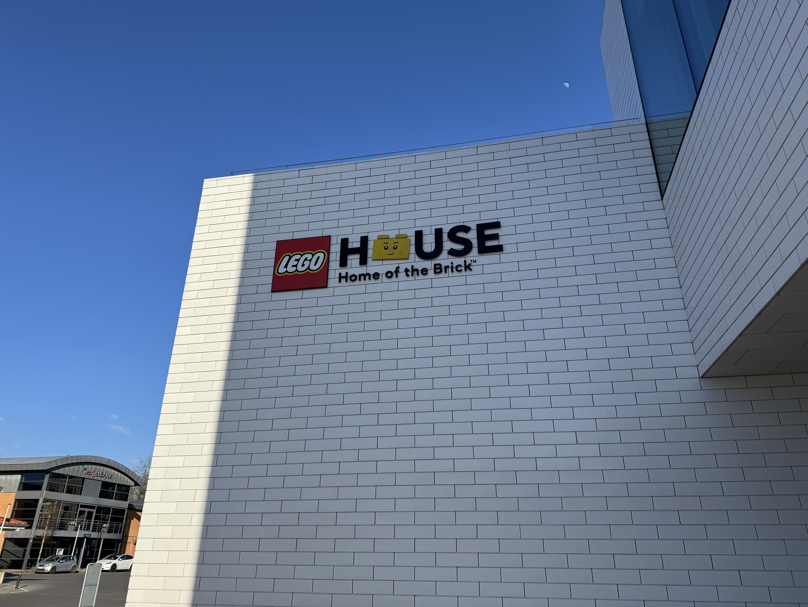
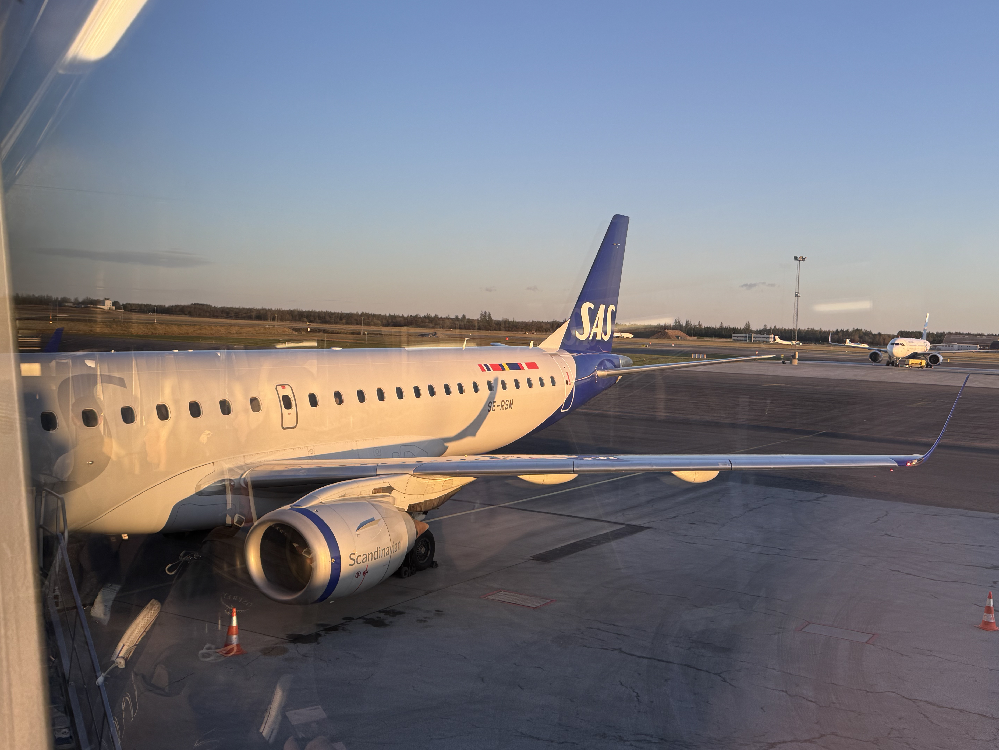
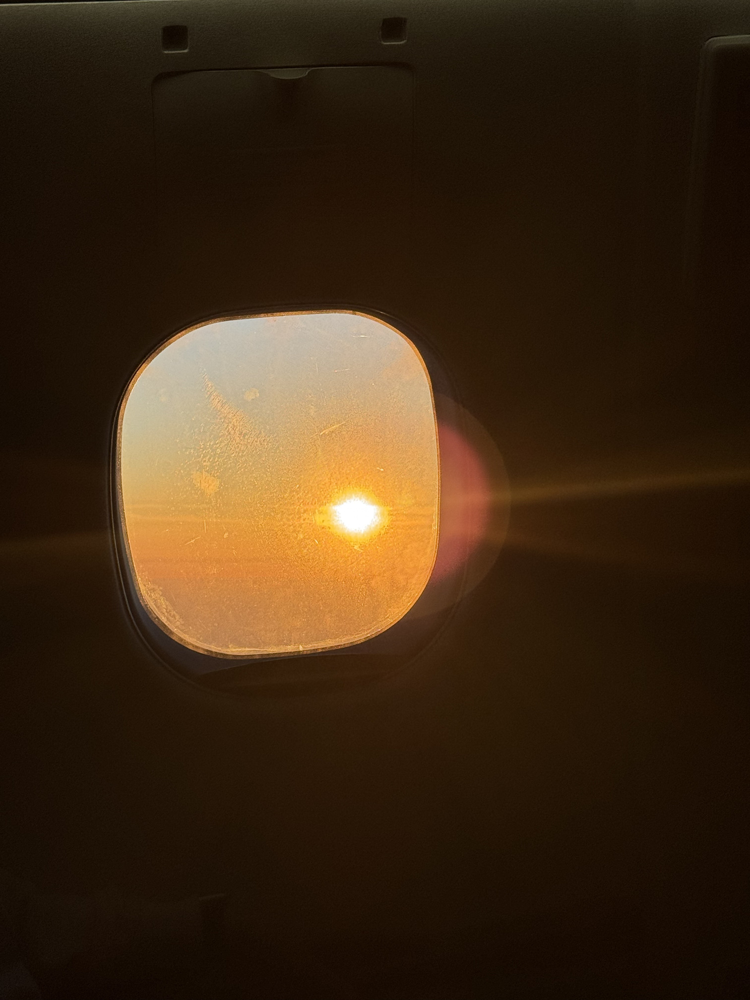

# Møllehøj, Danmark, 171 moh

_Gjennomført den 06.04.2025_

Hej!

Det er på tide å bestige en ny topp og denne gangen skal Danmarks høyeste topp bestiges. Og nei, det er ikke Himmelbjerget! Himmelbjerget er ikke engang på topp 10 lista over de høyeste toppene i Danmark. Men det er istedenfor toppen Møllehøj på 171 moh som skal bestiges.

Møllehøj befinner seg øst i regionen Midtjylland, litt sør-vest for Årland og nord-øst for Billund. Med tanke på hvor populært det er for nordmenn å dra til legoland så er det best tilgjengelighet med fly til Billund. Så la oss fly til Billund!

Jeg prøver å ta mest mulig kollektivt når jeg reiser, ikke nødvendigvis fra et miljø-perspektiv. Men fordi jeg synes det er mye mer behagelig å slippe å kjøre steder selv. Desverre er det slik at Møllehøj ligger ca. 45 minutter med bil unna Billund, mens kollektivt ville tatt 8-9 timer. Dermed har jeg krypet til korset og anskaffet en leiebil.

Med leiebilen hentet på flyplassen er det på tide å styre rattet mot Møllehøj.

Rett ved Møllehøj kommer vi til Danmarks tredje høyeste topp, Ejer Bavnehøj. Lenge trodd å være Danmarks høyeste topp, men i 2005 fant man ut at Møllehøj var 51 cm høyere enn Ejer Bavnhøj. Danmarks andre høyeste topp, Yding Skovhøj blir slått av Møllerhøj med snaue 9 cm!

Fra Ejer Bavnehøj er det en lang og tung tur til Møllerhøj... på ca. 4 minutter...

Og med det er Møllehøj på 171 meter over havet besteget! Selv om det ikke er en spesielt høy topp med tanke på Norske standarer, så er ikke utsikten så gærn. Spesielt når man treffer så godt på været.

Når man først har punga ut for leiebil så kan man bruke den for det den er verdt og det viser seg at Himmelbjerget bare er 20 minutter unna. Så jeg tar turen tid bare for å berge meg i tilfelle Danmark bestemmer seg på nytt hvilken av toppene deres som er høyest.

Etter Himmelbjerget må jeg tilbake til Billund. Er ikke så veldig mye av Danmark man får sett på 6 timer, men føler når man først er i Billund så må man få med seg litt relatert til Lego. Skal innrømme at guttungen inni meg hadde veldig lyst til å ta en spontant overnatting i Billund og dra på legoland. Også helt merkelig hvordan man tror man ikke husker noe fra et sted, men når man først står der så begynner man å huske veldig mye. Når jeg sto utenfor legoland så husket jeg veldig mye av når jeg var der som ish 9 år gammel.

Så var det på tide å sette fra seg leiebilen og dra hjem igjen til Norge.

[Vi ses på Malta!](/topper/45_malta)

