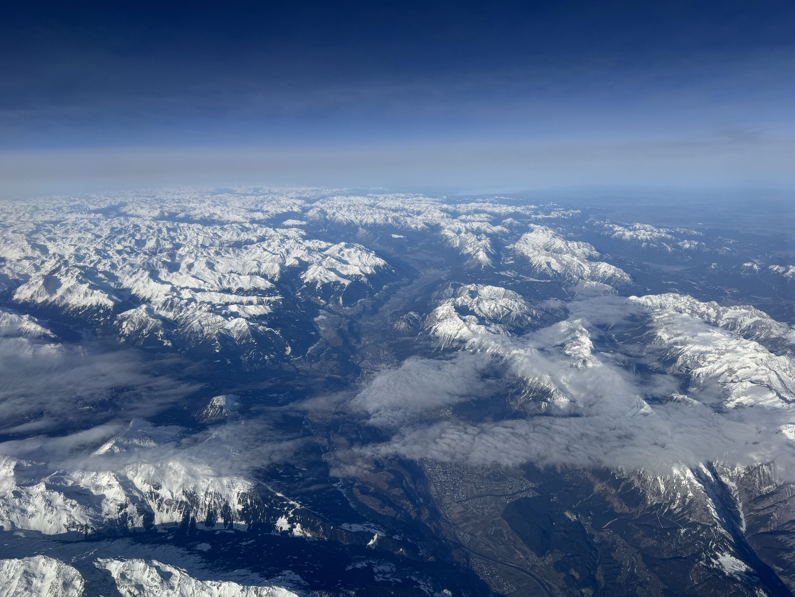

# Vatican hill, Vatikanstaten, 75 moh
Hei og velkommen til denne lille reisedagboken hvor jeg har som mål å besøke [alle land i Europa sin høyste topp](https://en.wikipedia.org/wiki/List_of_highest_points_of_European_countries). For morrohetens skyld så har jeg bestemt meg for å ta toppen fra lavest til høyest, som da betyr at den første toppen er i Vatikanstaten!

Jeg har begrenset meg til at toppene må være innenfor den geografiske delen av Europa, ettersom at noen av landene sin høyeste topp er i Karibia eller Grønnland. Noen av landene er også utilgjengelige av diverse politiske grunner, av egen sikkerhet vil jeg vente med disse til det er trygt å reise dit. Jeg gjør nettopp dette fordi jeg synes det er gøy, ikke fordi jeg må.

Men la oss komme oss avgårde til Vatikanstaten og toppen Vatican hill på 75 moh!

Vatikanstaten ligger i hjerte av Roma og det er derfor naturlig at vi må først komme oss til ...Roma!

