# Vatican hill, Vatikanstaten, 75 moh

_Gjennomført fra 21.02.2025 til 23.02.2025_

Hei og velkommen til denne lille reisedagboken hvor jeg har som mål å besøke [alle land i Europa sin høyste topp](https://en.wikipedia.org/wiki/List_of_highest_points_of_European_countries). For morrohetens skyld så har jeg bestemt meg for å ta toppen fra lavest til høyest, som da betyr at den første toppen er i Vatikanstaten!

Jeg har begrenset meg til at toppene må være innenfor den geografiske delen av Europa, ettersom at noen av landene sin høyeste topp er i Karibia eller Grønnland. Noen av landene er også utilgjengelige av diverse politiske grunner, av egen sikkerhet vil jeg vente med disse til det er trygt å reise dit. Jeg gjør nettopp dette fordi jeg synes det er gøy, ikke fordi jeg må.

Men la oss komme oss avgårde til Vatikanstaten og toppen Vatican hill på 75 moh!

Vatikanstaten ligger i hjerte av Roma og det er derfor naturlig at vi må først komme oss til ...Roma!

Fra Oslo går flyet direkte til Roma på litt under 3 timer, hvor man på en fin dag som dette får fine syn over Alpene på vei til den Italienske hovedstaden.

Fra Roma lufthavn går toget inn til sentrum (Roma termini) hvert 15 minutt og man er framme på ca. 30 minutter.

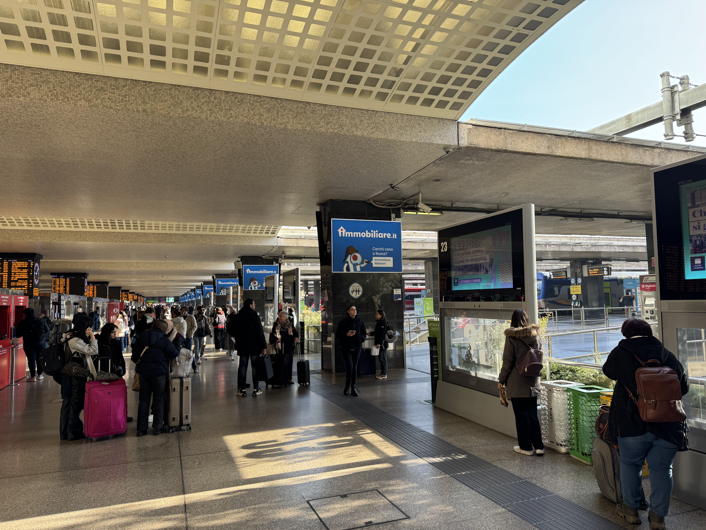

Og fra Roma termini er det bare et par t-bane stopp før man er fremme utenfor Basilica di San Pietro i Vatikanstaten.

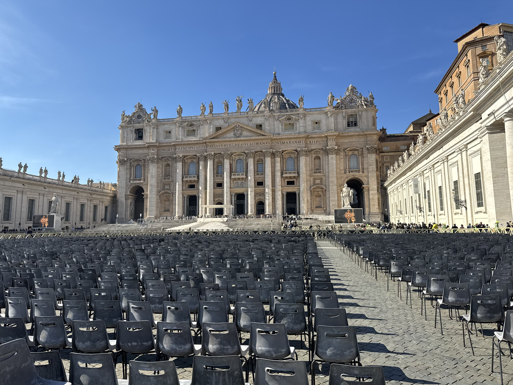

Etter en natt på hotel var det på tide å ta turen til Vatikanstaten sitt høyste punkt, Vatican hill. Vatican hill befinner seg i Vatican gardens rett bak Basilica di San Pietro. For å få tilgang til Vatican gardens må man [betale for både billett til Vatican museums og guide i Vatican gardens](https://tickets.museivaticani.va/home/calendar/visit/Giardini-Vaticani). Man møter opp ca. 30 minutter før oppsatt tid ved inngangen til Vatican museums, hvor man blir møtt av guiden som tar deg inn i Vatican gardens og opp mot Vatican hill.

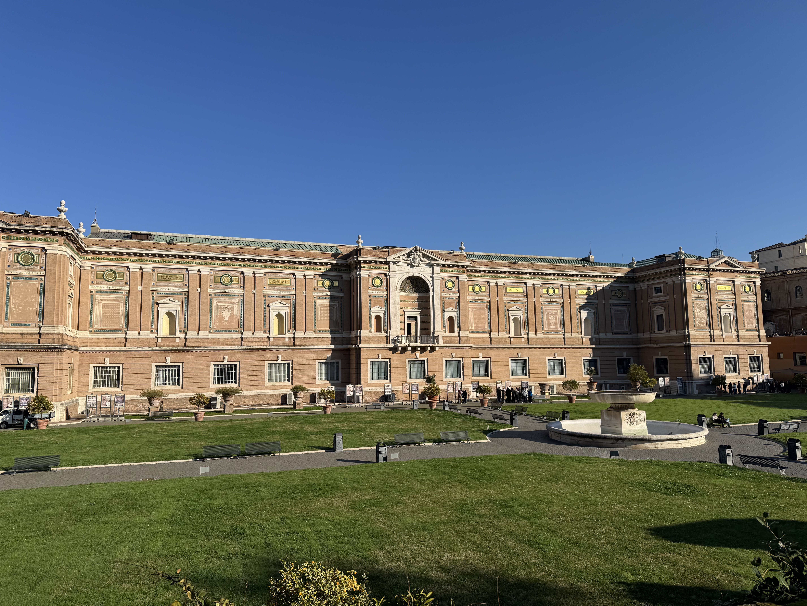

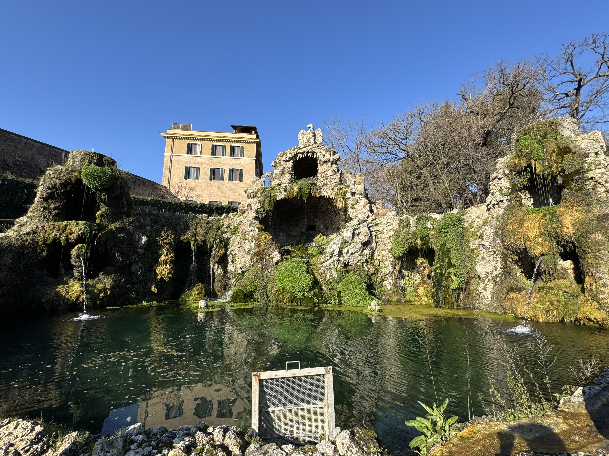

Etter ca. en halvtimes trasking og ikke den retteste veien mot toppen, så når vi toppen av Vatikanstaten, Vatican hill på hele 75 meter over havet! 

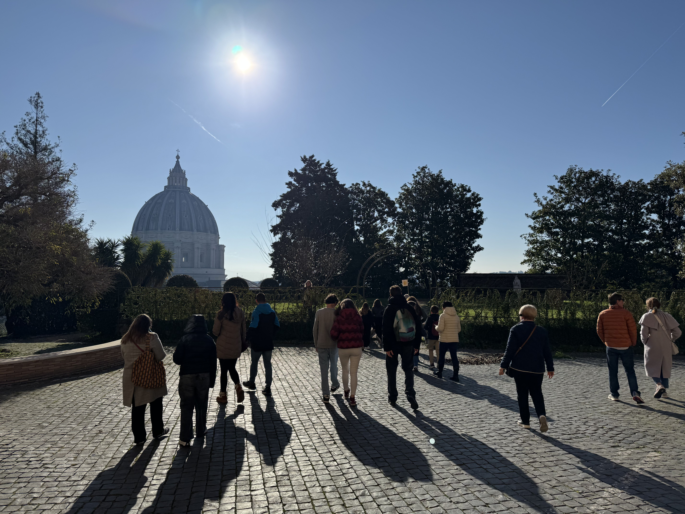

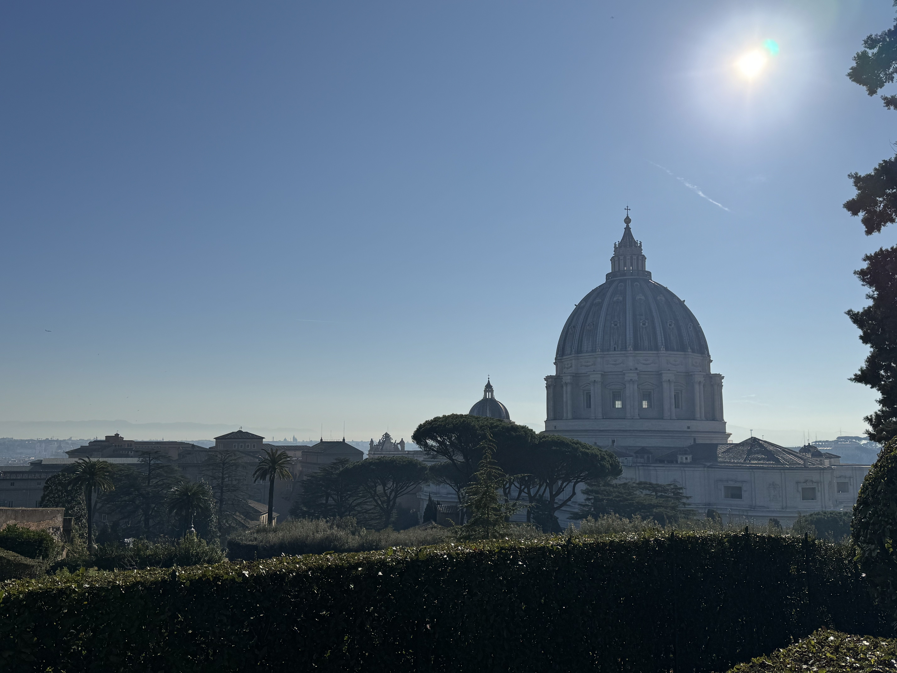

Etter de store høydedragene så gikk ferden videre nedover gjennom mer av Vatican gardens og inn i Vatican museums.

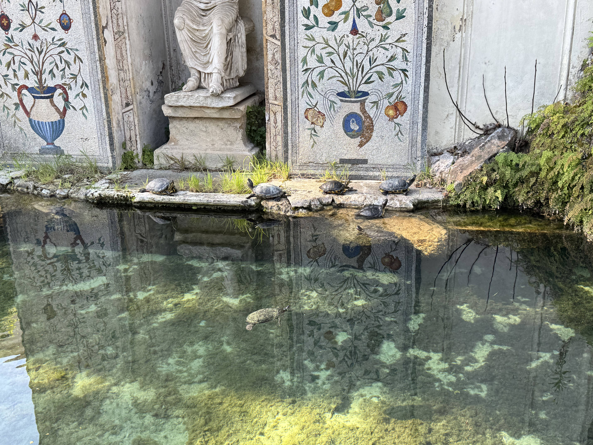

Og når man først er i Roma så er det muligens litt andre ting som kan være interresant å se på.

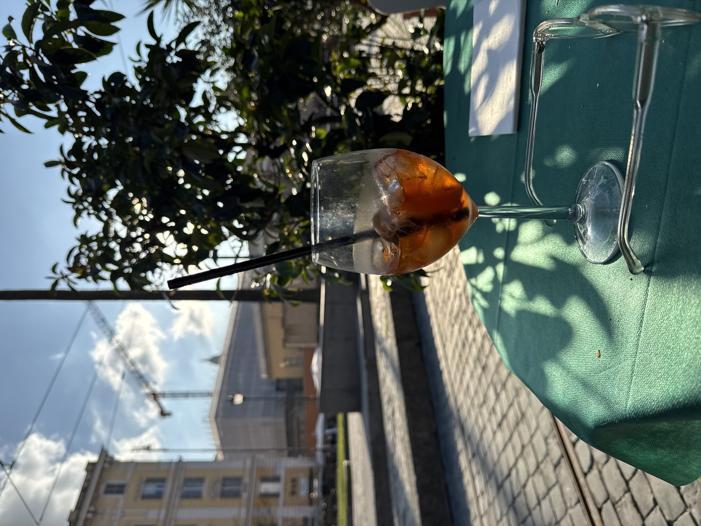

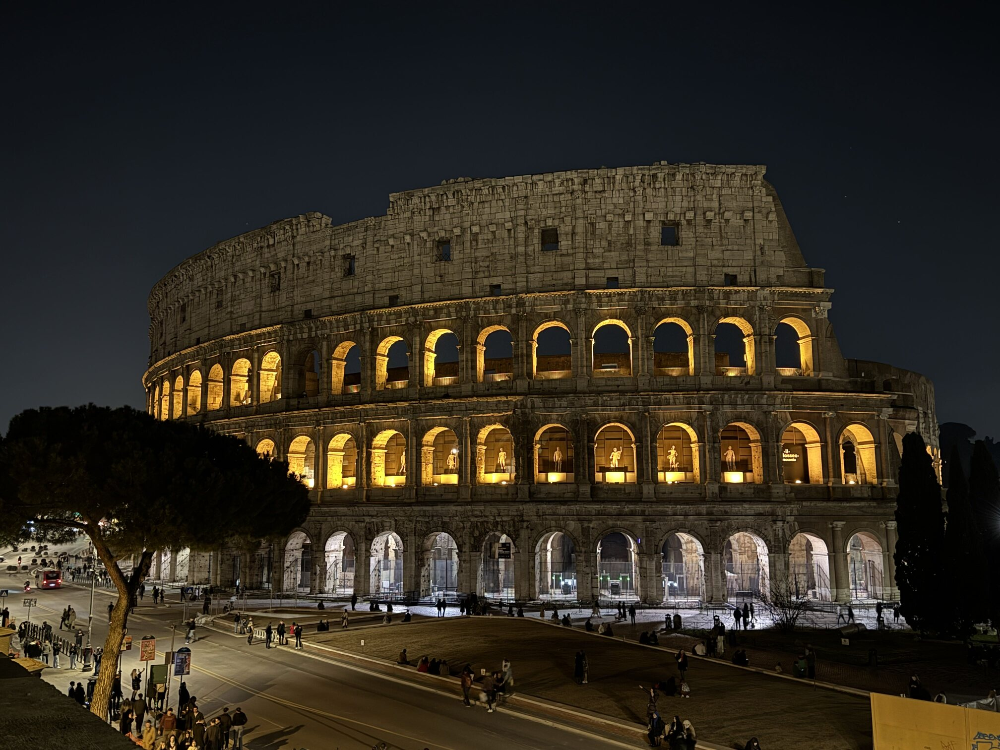

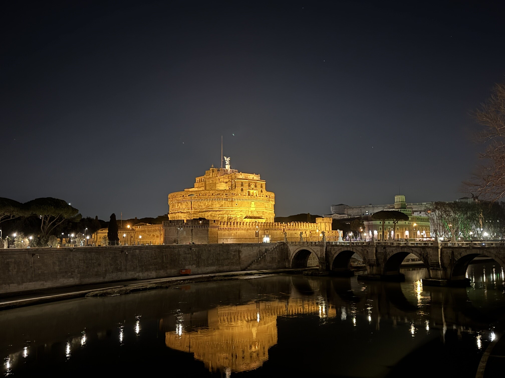

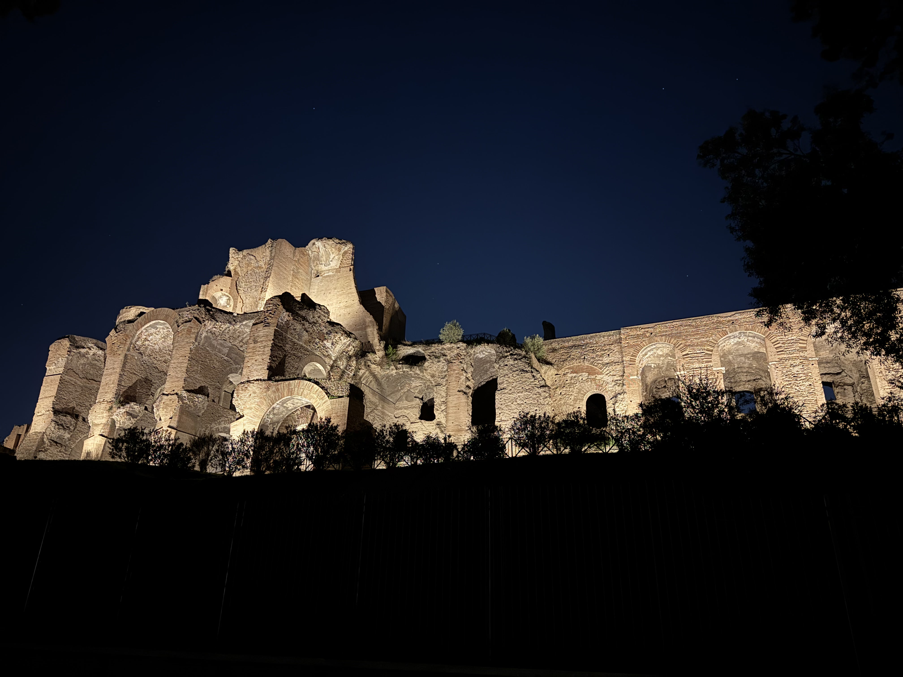

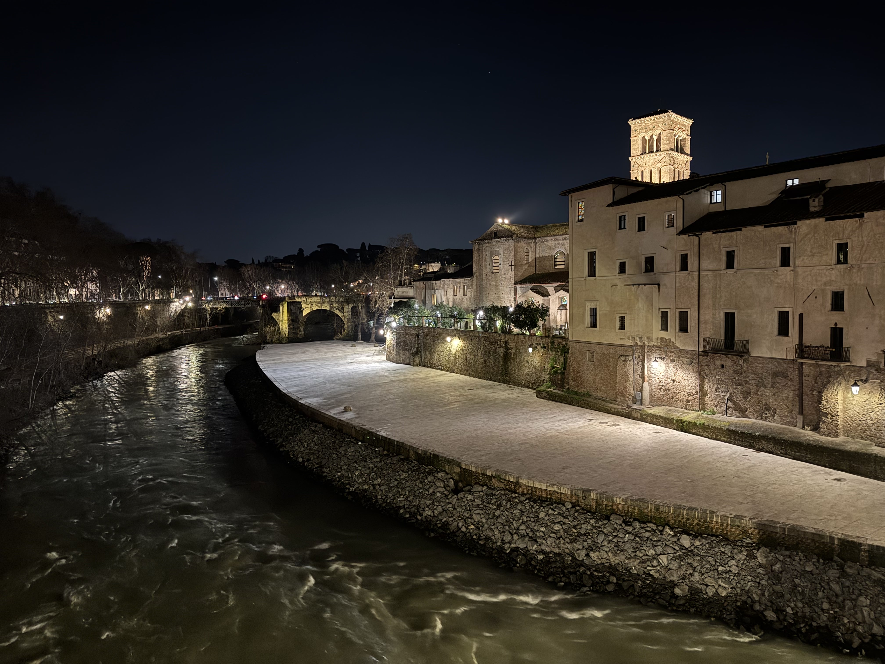

Og med det er det på tide å vende hjemover mot Oslo. På grunn av noe som heter "Vinterferie" så er prisene direkte hjem skyhøye og jeg må belage meg på et stopp i Stockholm. Glemte å ta bilde av flyet på bakken i Roma, bare forestill deg at været er mer likt Middelhavet enn Skandinavia.

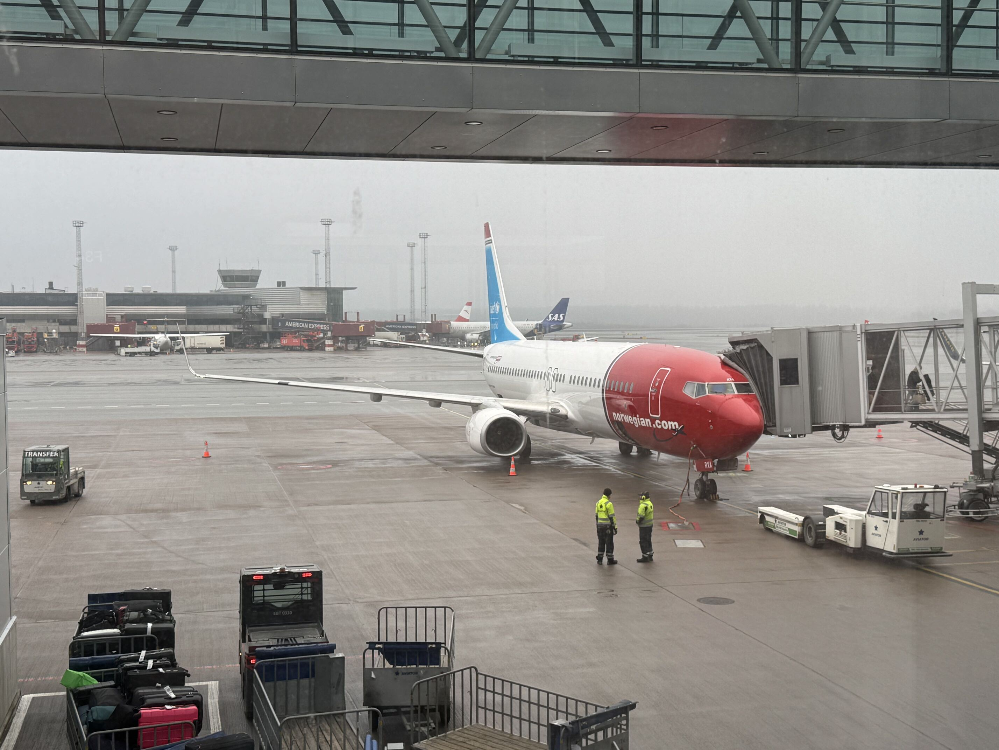

Vi sees på neste topp, [Chemin des Révoires i Monaco!](/topper/47_monaco)